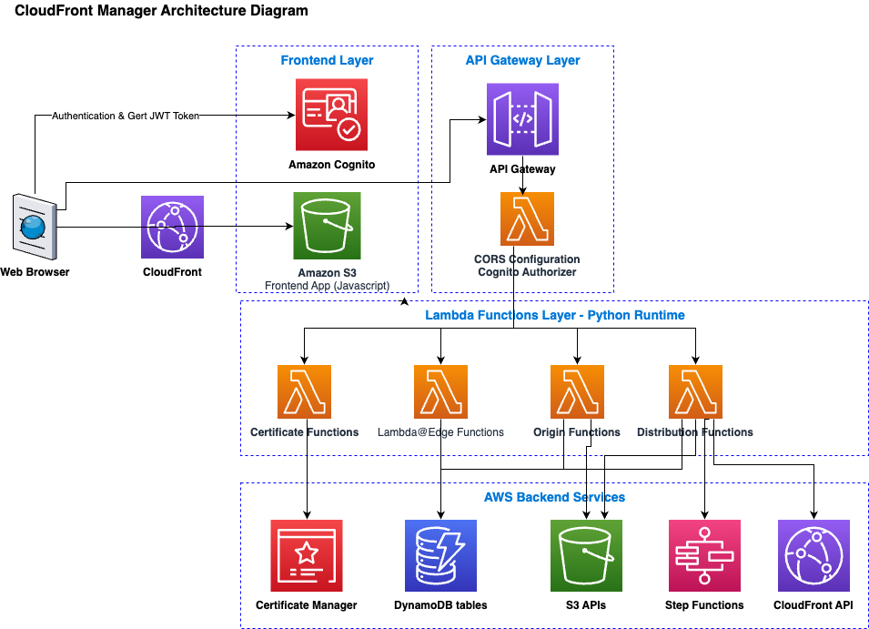
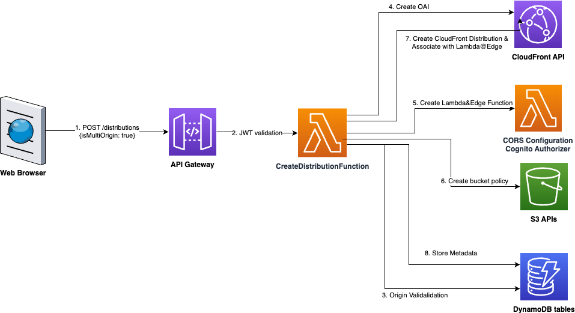
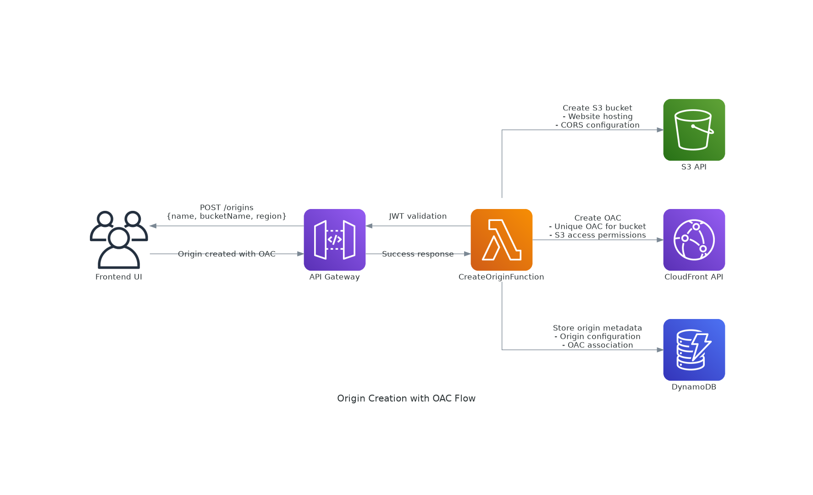
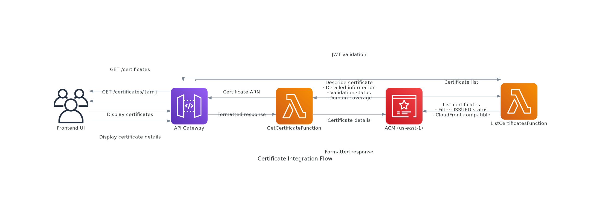

# 📚 CloudFront Manager - API 문서

## 🏗️ **시스템 아키텍처 개요**

CloudFront Manager는 개발자들이 Application 패키치 배포를 위한 CloudFront 배포를 스스로 할 수 있도록 하는 목적으로 만든 도구입니다. (현재 데모 버젼입니다.)
개발자들은 CloudFront Manager를 통해 아래 미리 설정된 정책에 따라 쉽게 CloudFront distribution을 생성/관리/삭제할 수 있습니다. 

- AWS Certificate Manager를 통한 SSL 인증서 연결
- HTTP 버전 설정 (HTTP/3)
- 캐시 정책 설정 및 압축 옵션 설정
- CNAME 설정
- CloudWatch 로깅 설정
- 멀티 S3 오리전 설정
- Lambda@Edge 함수를 통해 가까운 S3 오리진으로 runtime 연결


# 🎯 **API 아키텍처 요약**


## **아키텍처 다이어그램**

아래 다이아그램은 CloudFront Manager의 전체 아키텍쳐를 도시합니다. Frontend application은 S3에 저장된 static HTML/Javascript으로 구현되어 있고 사용자 인증을 위해 Amazon Cognito User pool을  사용합니다. Amazon API Gateway에서 제공하는 모든 API endpoint에 접근하기 위해서는 Amazon Cognito 인증을 통해 받은 JWT(Json Web Token)을 `Authorization: Bearer <token>` 헤더에 포함해야 합니다.

API endpoint 요청에 대해 Cognito Authorizer Lambda 함수가 토큰이 유효한지를 검사한 뒤 유효하면 backend Lambda 함수들을 호출합니다. 





### **인증**
모든 API 엔드포인트는 `Authorization` 헤더를 통한 **Cognito JWT 인증**이 필요합니다:
```
Authorization: Bearer <JWT_TOKEN>
```

## 🔗 **API 엔드포인트 개요**
API Gateway를 통해 아래 각 카테고리 별 API들을 제공합니다.

| 카테고리 | 엔드포인트 | 목적 |
|----------|-----------|------|
| **배포** | `/distributions/*` | CloudFront 배포 관리 |
| **오리진** | `/origins/*` | OAC/OAI를 사용한 S3 오리진 관리 |
| **인증서** | `/certificates/*` | SSL 인증서 관리 |
| **Lambda@Edge** | `/lambda-edge/*` | 멀티 오리진 라우팅 함수 |


---

# 📦 **배포 관리 API**

## **API Gateway 리소스 및 Lambda 함수 매핑**

| API Gateway 리소스 | 경로 & 메서드 | 설명 | Lambda 함수 |
|-------------------|--------------|------|-------------|
| `distributionsResource` | `GET /distributions` | 모든 CloudFront 배포 목록 조회 | `ListDistributionsFunction` |
| `distributionsResource` | `POST /distributions` | 새로운 CloudFront 배포 생성 (단일/멀티 오리진) | `CreateDistributionProxyFunction` |
| `distributionResource` | `GET /distributions/{id}` | 특정 배포의 세부 정보 조회 | `GetDistributionFunction` |
| `distributionResource` | `PUT /distributions/{id}` | 기존 배포 구성 업데이트 | `UpdateDistributionFunction` |
| `distributionResource` | `DELETE /distributions/{id}` | 배포 삭제 및 관련 리소스 정리 | `DeleteDistributionFunction` |
| `distributionStatusResource` | `GET /distributions/{id}/status` | 배포의 현재 배포 상태 확인 | `GetDistributionStatusFunction` |
| `distributionInvalidateResource` | `POST /distributions/{id}/invalidate` | CloudFront 캐시 무효화 생성 | `InvalidateDistributionFunction` |

---

## **GET /distributions**
모든 CloudFront 배포 목록 조회

### **요청**
```http
GET /distributions
Authorization: Bearer <JWT_TOKEN>
```

### **응답**
```json
{
  "success": true,
  "data": {
    "distributions": [
      {
        "id": "dist-12345",
        "name": "내 배포",
        "cloudfrontId": "E1234567890123",
        "status": "Deployed",
        "domainName": "d1234567890123.cloudfront.net",
        "isMultiOrigin": false,
        "createdAt": "2025-07-08T10:00:00Z"
      }
    ]
  }
}
```

---

## **POST /distributions**
새로운 CloudFront 배포 생성

### **요청**
```http
POST /distributions
Authorization: Bearer <JWT_TOKEN>
Content-Type: application/json

{
  "name": "새로운 배포",
  "isMultiOrigin": false,
  "config": {
    "Comment": "내 배포 설명",
    "Enabled": true,
    "Origins": {
      "Quantity": 1,
      "Items": [
        {
          "Id": "origin-1",
          "DomainName": "mybucket.s3.amazonaws.com",
          "S3OriginConfig": {
            "OriginAccessIdentity": ""
          }
        }
      ]
    },
    "DefaultCacheBehavior": {
      "TargetOriginId": "origin-1",
      "ViewerProtocolPolicy": "redirect-to-https"
    }
  }
}
```

### **멀티 오리진 요청**
```json
{
  "name": "글로벌 멀티 오리진 배포",
  "isMultiOrigin": true,
  "multiOriginConfig": {
    "defaultOriginId": "origin-us-east-1",
    "additionalOriginIds": ["origin-eu-central-1", "origin-ap-southeast-1"],
    "preset": "global-3-region"
  },
  "config": {
    "Comment": "Lambda@Edge를 사용한 멀티 오리진 배포",
    "Enabled": true
  }
}
```

### **응답**
```json
{
  "success": true,
  "data": {
    "distribution": {
      "id": "dist-67890",
      "name": "새로운 배포",
      "cloudfrontId": "E9876543210987",
      "status": "InProgress",
      "domainName": "d9876543210987.cloudfront.net",
      "isMultiOrigin": false
    }
  },
  "message": "배포가 성공적으로 생성되었습니다"
}
```

---

## **GET /distributions/{id}**
배포 세부 정보 조회

### **요청**
```http
GET /distributions/dist-12345
Authorization: Bearer <JWT_TOKEN>
```

### **응답**
```json
{
  "success": true,
  "data": {
    "distribution": {
      "id": "dist-12345",
      "name": "내 배포",
      "cloudfrontId": "E1234567890123",
      "status": "Deployed",
      "domainName": "d1234567890123.cloudfront.net",
      "arn": "arn:aws:cloudfront::123456789012:distribution/E1234567890123",
      "isMultiOrigin": true,
      "multiOriginConfig": {
        "defaultOriginId": "origin-us-east-1",
        "additionalOriginIds": ["origin-eu-central-1"],
        "preset": "global-3-region"
      },
      "lambdaEdgeFunctionId": "func-abc123",
      "oaiId": "E1URK07W5SXT02",
      "createdAt": "2025-07-08T10:00:00Z",
      "updatedAt": "2025-07-08T10:30:00Z"
    }
  }
}
```

---

## **PUT /distributions/{id}**
배포 구성 업데이트

### **요청**
```http
PUT /distributions/dist-12345
Authorization: Bearer <JWT_TOKEN>
Content-Type: application/json

{
  "name": "업데이트된 배포 이름",
  "config": {
    "Comment": "업데이트된 설명",
    "Enabled": true
  }
}
```

### **응답**
```json
{
  "success": true,
  "data": {
    "distribution": {
      "id": "dist-12345",
      "name": "업데이트된 배포 이름",
      "status": "InProgress"
    }
  },
  "message": "배포가 성공적으로 업데이트되었습니다"
}
```

---

## **DELETE /distributions/{id}**
배포 삭제

### **요청**
```http
DELETE /distributions/dist-12345
Authorization: Bearer <JWT_TOKEN>
```

### **응답**
```json
{
  "success": true,
  "message": "배포가 성공적으로 삭제되었습니다"
}
```

---

## **GET /distributions/{id}/status**
배포 배포 상태 조회

### **요청**
```http
GET /distributions/dist-12345/status
Authorization: Bearer <JWT_TOKEN>
```

### **응답**
```json
{
  "success": true,
  "data": {
    "status": "Deployed",
    "lastUpdated": "2025-07-08T10:30:00Z",
    "deploymentProgress": 100
  }
}
```

---

## **POST /distributions/{id}/invalidate**
캐시 무효화 생성

### **요청**
```http
POST /distributions/dist-12345/invalidate
Authorization: Bearer <JWT_TOKEN>
Content-Type: application/json

{
  "paths": ["/*", "/images/*"],
  "callerReference": "invalidation-2025-07-08-001"
}
```

### **응답**
```json
{
  "success": true,
  "data": {
    "invalidationId": "I1234567890123",
    "status": "InProgress",
    "paths": ["/*", "/images/*"]
  },
  "message": "캐시 무효화가 성공적으로 생성되었습니다"
}
```


---

# 🎯 **오리진 관리 API**

## **API Gateway 리소스 및 Lambda 함수 매핑**

| API Gateway 리소스 | 경로 & 메서드 | 설명 | Lambda 함수 |
|-------------------|--------------|------|-------------|
| `originsResource` | `GET /origins` | 모든 S3 오리진 목록 조회 | `ListOriginsFunction` |
| `originsResource` | `POST /origins` | 자동 OAC 설정으로 새로운 S3 오리진 생성 | `CreateOriginFunction` |
| `originResource` | `GET /origins/{id}` | 특정 S3 오리진의 세부 정보 조회 | `GetOriginFunction` |
| `originResource` | `PUT /origins/{id}` | S3 오리진 구성 업데이트 | `UpdateOriginFunction` |
| `originResource` | `DELETE /origins/{id}` | S3 오리진 삭제 및 관련 리소스 정리 | `DeleteOriginFunction` |

---

## **GET /origins**
모든 S3 오리진 목록 조회

### **요청**
```http
GET /origins
Authorization: Bearer <JWT_TOKEN>
```

### **응답**
```json
{
  "success": true,
  "data": {
    "origins": [
      {
        "originId": "origin-12345",
        "name": "US East 오리진",
        "bucketName": "my-content-bucket-us",
        "region": "us-east-1",
        "oacId": "E1234567890123",
        "websiteHosting": {
          "enabled": true,
          "indexDocument": "index.html",
          "errorDocument": "error.html"
        },
        "corsConfiguration": {
          "enabled": true,
          "allowedOrigins": ["*"],
          "allowedMethods": ["GET", "HEAD"]
        },
        "associatedDistributions": [
          "arn:aws:cloudfront::123456789012:distribution/E1234567890123"
        ],
        "createdAt": "2025-07-08T09:00:00Z"
      }
    ]
  }
}
```

---

## **POST /origins**
자동 OAC 설정으로 새로운 S3 오리진 생성

### **요청**
```http
POST /origins
Authorization: Bearer <JWT_TOKEN>
Content-Type: application/json

{
  "name": "Europe Central 오리진",
  "bucketName": "my-content-bucket-eu",
  "region": "eu-central-1",
  "websiteHosting": {
    "enabled": true,
    "indexDocument": "index.html",
    "errorDocument": "404.html"
  },
  "corsConfiguration": {
    "enabled": true,
    "allowedOrigins": ["https://mydomain.com"],
    "allowedMethods": ["GET", "HEAD", "OPTIONS"],
    "allowedHeaders": ["*"],
    "maxAgeSeconds": 3600
  }
}
```

### **응답**
```json
{
  "success": true,
  "data": {
    "origin": {
      "originId": "origin-67890",
      "name": "Europe Central 오리진",
      "bucketName": "my-content-bucket-eu",
      "region": "eu-central-1",
      "oacId": "E9876543210987",
      "bucketUrl": "https://my-content-bucket-eu.s3.eu-central-1.amazonaws.com"
    }
  },
  "message": "OAC와 함께 S3 오리진이 성공적으로 생성되었습니다"
}
```

---

## **GET /origins/{id}**
오리진 세부 정보 조회

### **요청**
```http
GET /origins/origin-12345
Authorization: Bearer <JWT_TOKEN>
```

### **응답**
```json
{
  "success": true,
  "data": {
    "origin": {
      "originId": "origin-12345",
      "name": "US East 오리진",
      "bucketName": "my-content-bucket-us",
      "region": "us-east-1",
      "oacId": "E1234567890123",
      "websiteHosting": {
        "enabled": true,
        "indexDocument": "index.html",
        "errorDocument": "error.html"
      },
      "corsConfiguration": {
        "enabled": true,
        "allowedOrigins": ["*"],
        "allowedMethods": ["GET", "HEAD"],
        "allowedHeaders": ["*"],
        "maxAgeSeconds": 3600
      },
      "associatedDistributions": [
        "arn:aws:cloudfront::123456789012:distribution/E1234567890123"
      ],
      "bucketPolicy": {
        "hasOacAccess": true,
        "hasOaiAccess": false
      },
      "createdAt": "2025-07-08T09:00:00Z",
      "updatedAt": "2025-07-08T10:00:00Z"
    }
  }
}
```

---

## **PUT /origins/{id}**
오리진 구성 업데이트

### **요청**
```http
PUT /origins/origin-12345
Authorization: Bearer <JWT_TOKEN>
Content-Type: application/json

{
  "name": "업데이트된 US East 오리진",
  "websiteHosting": {
    "enabled": true,
    "indexDocument": "home.html",
    "errorDocument": "404.html"
  },
  "corsConfiguration": {
    "enabled": true,
    "allowedOrigins": ["https://mydomain.com", "https://www.mydomain.com"],
    "allowedMethods": ["GET", "HEAD", "OPTIONS"],
    "allowedHeaders": ["Authorization", "Content-Type"],
    "maxAgeSeconds": 7200
  }
}
```

### **응답**
```json
{
  "success": true,
  "data": {
    "origin": {
      "originId": "origin-12345",
      "name": "업데이트된 US East 오리진"
    }
  },
  "message": "오리진이 성공적으로 업데이트되었습니다"
}
```

---

## **DELETE /origins/{id}**
오리진 삭제 및 리소스 정리

### **요청**
```http
DELETE /origins/origin-12345
Authorization: Bearer <JWT_TOKEN>
```

### **응답**
```json
{
  "success": true,
  "message": "오리진 및 관련 리소스가 성공적으로 삭제되었습니다"
}
```

# 🔐 **인증서 관리 API**

## **API Gateway 리소스 및 Lambda 함수 매핑**

| API Gateway 리소스 | 경로 & 메서드 | 설명 | Lambda 함수 |
|-------------------|--------------|------|-------------|
| `certificatesResource` | `GET /certificates` | CloudFront용 SSL 인증서 목록 조회 (ACM us-east-1) | `ListCertificatesFunction` |
| `certificateResource` | `GET /certificates/{arn}` | 특정 SSL 인증서의 상세 정보 조회 | `GetCertificateFunction` |

---

## **GET /certificates**
AWS Certificate Manager에서 SSL 인증서 목록 조회

### **요청**
```http
GET /certificates
Authorization: Bearer <JWT_TOKEN>
```

### **응답**
```json
{
  "success": true,
  "data": {
    "certificates": [
      {
        "certificateArn": "arn:aws:acm:us-east-1:123456789012:certificate/12345678-1234-1234-1234-123456789012",
        "domainName": "*.example.com",
        "subjectAlternativeNames": ["example.com", "www.example.com"],
        "status": "ISSUED",
        "type": "AMAZON_ISSUED",
        "keyAlgorithm": "RSA-2048",
        "keyUsages": ["DIGITAL_SIGNATURE", "KEY_ENCIPHERMENT"],
        "extendedKeyUsages": ["TLS_WEB_SERVER_AUTHENTICATION"],
        "createdAt": "2025-06-01T10:00:00Z",
        "issuedAt": "2025-06-01T10:30:00Z",
        "notBefore": "2025-06-01T00:00:00Z",
        "notAfter": "2026-06-01T23:59:59Z"
      }
    ]
  }
}
```

### **Lambda 함수**: `ListCertificatesFunction`
### **AWS 서비스**: ACM (us-east-1)
### **목적**: CloudFront에서 사용 가능한 모든 SSL 인증서 목록 조회 (us-east-1에 있어야 함)

---

## **GET /certificates/{arn}**
인증서 세부 정보 조회

### **요청**
```http
GET /certificates/arn:aws:acm:us-east-1:123456789012:certificate:12345678-1234-1234-1234-123456789012
Authorization: Bearer <JWT_TOKEN>
```

### **응답**
```json
{
  "success": true,
  "data": {
    "certificate": {
      "certificateArn": "arn:aws:acm:us-east-1:123456789012:certificate/12345678-1234-1234-1234-123456789012",
      "domainName": "*.example.com",
      "subjectAlternativeNames": ["example.com", "www.example.com"],
      "domainValidationOptions": [
        {
          "domainName": "*.example.com",
          "validationDomain": "example.com",
          "validationStatus": "SUCCESS",
          "validationMethod": "DNS"
        }
      ],
      "status": "ISSUED",
      "type": "AMAZON_ISSUED",
      "keyAlgorithm": "RSA-2048",
      "keyUsages": ["DIGITAL_SIGNATURE", "KEY_ENCIPHERMENT"],
      "extendedKeyUsages": ["TLS_WEB_SERVER_AUTHENTICATION"],
      "certificateTransparencyLoggingPreference": "ENABLED",
      "renewalEligibility": "ELIGIBLE",
      "serial": "01:23:45:67:89:ab:cd:ef",
      "subject": "CN=*.example.com",
      "issuer": "Amazon",
      "createdAt": "2025-06-01T10:00:00Z",
      "issuedAt": "2025-06-01T10:30:00Z",
      "notBefore": "2025-06-01T00:00:00Z",
      "notAfter": "2026-06-01T23:59:59Z"
    }
  }
}
```

### **Lambda 함수**: `GetCertificateFunction`
### **AWS 서비스**: ACM (us-east-1)
### **목적**: CloudFront 구성을 위한 상세한 인증서 정보 조회

---

# ⚡ **Lambda@Edge 관리 API**

## **API Gateway 리소스 및 Lambda 함수 매핑**

| API Gateway 리소스 | 경로 & 메서드 | 설명 | Lambda 함수 |
|-------------------|--------------|------|-------------|
| `lambdaEdgeFunctionsResource` | `GET /lambda-edge/functions` | 멀티 오리진 라우팅용 Lambda@Edge 함수 목록 조회 | `ListLambdaEdgeFunctionsFunction` |
| `lambdaEdgeFunctionsResource` | `POST /lambda-edge/functions` | 지리적 라우팅용 독립형 Lambda@Edge 함수 생성 | `CreateLambdaEdgeFunctionFunction` |
| `lambdaEdgeFunctionResource` | `GET /lambda-edge/functions/{id}` | 특정 Lambda@Edge 함수의 상세 정보 조회 | `GetLambdaEdgeFunctionFunction` |
| `lambdaEdgePreviewResource` | `POST /lambda-edge/preview` | Lambda@Edge 함수 코드 생성 및 미리보기 | `PreviewLambdaEdgeFunctionFunction` |

---

## **GET /lambda-edge/functions**
Lambda@Edge 함수 목록 조회

### **요청**
```http
GET /lambda-edge/functions
Authorization: Bearer <JWT_TOKEN>
```

### **응답**
```json
{
  "success": true,
  "data": {
    "functions": [
      {
        "functionId": "func-12345",
        "functionName": "demo50-multi-origin-func-abc123",
        "functionArn": "arn:aws:lambda:us-east-1:123456789012:function:demo50-multi-origin-func-abc123",
        "versionArn": "arn:aws:lambda:us-east-1:123456789012:function:demo50-multi-origin-func-abc123:1",
        "status": "Active",
        "preset": "global-3-region",
        "origins": {
          "default": {
            "originId": "origin-us-east-1",
            "region": "us-east-1",
            "bucketName": "content-bucket-us"
          },
          "additional": [
            {
              "originId": "origin-eu-central-1",
              "region": "eu-central-1",
              "bucketName": "content-bucket-eu"
            }
          ]
        },
        "createdAt": "2025-07-08T10:00:00Z",
        "createdBy": "user@example.com"
      }
    ]
  }
}
```

---

## **POST /lambda-edge/functions**
Lambda@Edge 함수 생성

### **요청**
```http
POST /lambda-edge/functions
Authorization: Bearer <JWT_TOKEN>
Content-Type: application/json

{
  "name": "custom-routing-function",
  "preset": "geographic",
  "origins": {
    "default": {
      "originId": "origin-us-east-1",
      "region": "us-east-1",
      "bucketName": "content-bucket-us"
    },
    "additional": [
      {
        "originId": "origin-eu-central-1",
        "region": "eu-central-1",
        "bucketName": "content-bucket-eu"
      },
      {
        "originId": "origin-ap-southeast-1",
        "region": "ap-southeast-1",
        "bucketName": "content-bucket-sg"
      }
    ]
  }
}
```

### **응답**
```json
{
  "success": true,
  "data": {
    "function": {
      "functionId": "func-67890",
      "functionName": "custom-routing-function-def456",
      "functionArn": "arn:aws:lambda:us-east-1:123456789012:function:custom-routing-function-def456",
      "versionArn": "arn:aws:lambda:us-east-1:123456789012:function:custom-routing-function-def456:1",
      "status": "Active"
    }
  },
  "message": "Lambda@Edge 함수가 성공적으로 생성되었습니다"
}
```

---

## **GET /lambda-edge/functions/{id}**
Lambda@Edge 함수 세부 정보 조회

### **요청**
```http
GET /lambda-edge/functions/func-12345
Authorization: Bearer <JWT_TOKEN>
```

### **응답**
```json
{
  "success": true,
  "data": {
    "function": {
      "functionId": "func-12345",
      "functionName": "demo50-multi-origin-func-abc123",
      "functionArn": "arn:aws:lambda:us-east-1:123456789012:function:demo50-multi-origin-func-abc123",
      "versionArn": "arn:aws:lambda:us-east-1:123456789012:function:demo50-multi-origin-func-abc123:1",
      "status": "Active",
      "preset": "global-3-region",
      "codeSize": 2048,
      "timeout": 5,
      "memorySize": 128,
      "runtime": "nodejs18.x",
      "origins": {
        "default": {
          "originId": "origin-us-east-1",
          "region": "us-east-1",
          "bucketName": "content-bucket-us"
        },
        "additional": [
          {
            "originId": "origin-eu-central-1",
            "region": "eu-central-1",
            "bucketName": "content-bucket-eu"
          }
        ]
      },
      "associatedDistributions": [
        "arn:aws:cloudfront::123456789012:distribution/E1234567890123"
      ],
      "createdAt": "2025-07-08T10:00:00Z",
      "updatedAt": "2025-07-08T10:30:00Z",
      "createdBy": "user@example.com"
    }
  }
}
```

---

## **POST /lambda-edge/preview**
생성된 Lambda@Edge 함수 코드 미리보기

### **요청**
```http
POST /lambda-edge/preview
Authorization: Bearer <JWT_TOKEN>
Content-Type: application/json

{
  "preset": "geographic",
  "origins": {
    "default": {
      "originId": "origin-us-east-1",
      "region": "us-east-1",
      "bucketName": "content-bucket-us"
    },
    "additional": [
      {
        "originId": "origin-eu-central-1",
        "region": "eu-central-1",
        "bucketName": "content-bucket-eu"
      }
    ]
  }
}
``` 

### **응답**
```json
{
  "success": true,
  "data": {
    "functionCode": "exports.handler = async (event) => {\n    const request = event.Records[0].cf.request;\n    const headers = request.headers;\n    \n    // 오리진 매핑 구성\n    const origins = {\n        \"origin-us-east-1\": {\n            \"domainName\": \"content-bucket-us.s3.us-east-1.amazonaws.com\",\n            \"region\": \"us-east-1\",\n            \"bucketName\": \"content-bucket-us\"\n        },\n        \"origin-eu-central-1\": {\n            \"domainName\": \"content-bucket-eu.s3.eu-central-1.amazonaws.com\",\n            \"region\": \"eu-central-1\",\n            \"bucketName\": \"content-bucket-eu\"\n        }\n    };\n    \n    // 지리적 라우팅 로직...\n    return request;\n};",
    "preset": "geographic",
    "originCount": 2,
    "estimatedSize": 2048
  }
}
```

# 🔄 **API 플로우 예제**

## **멀티 오리진 배포 생성 플로우**



**Diagram-as-Code로 생성된 플로우 다이어그램**


## **OAC를 사용한 오리진 생성 플로우**



**Diagram-as-Code로 생성된 플로우 다이어그램**

```python
# 다이어그램 생성 코드: diagrams/origin_creation_flow.py
from diagrams import Diagram, Edge
from diagrams.aws.compute import Lambda
from diagrams.aws.network import CloudFront, APIGateway
from diagrams.aws.database import Dynamodb
from diagrams.aws.storage import S3
from diagrams.onprem.client import Users

with Diagram("Origin Creation with OAC Flow", direction="LR"):
    # OAC를 사용한 오리진 생성 플로우 정의
    # 완전한 코드는 diagrams/origin_creation_flow.py 참조
```

## **인증서 통합 플로우**



**Diagram-as-Code로 생성된 플로우 다이어그램**

```python
# 다이어그램 생성 코드: diagrams/certificate_integration_flow.py
from diagrams import Diagram, Edge
from diagrams.aws.compute import Lambda
from diagrams.aws.network import APIGateway
from diagrams.aws.security import CertificateManager
from diagrams.onprem.client import Users

with Diagram("Certificate Integration Flow", direction="LR"):
    # 인증서 통합 플로우 정의
    # 완전한 코드는 diagrams/certificate_integration_flow.py 참조
```


---

# 🔐 **보안 고려사항**

## **인증 및 권한 부여**
- 모든 엔드포인트에 유효한 Cognito JWT 토큰 필요
- 토큰은 24시간 후 만료 (구성 가능)
- Cognito 그룹을 통한 역할 기반 액세스 제어
- API Gateway 요청 검증 및 스로틀링

## **데이터 보호**
- HTTPS/TLS 1.2+를 통한 모든 API 통신
- DynamoDB에서 민감한 데이터 저장 시 암호화
- S3 버킷 정책으로 CloudFront OAC/OAI 액세스 제한
- Lambda@Edge 함수는 최소 권한 IAM 역할 사용

## **네트워크 보안**
- AWS WAF 보호와 함께 배포된 API Gateway
- CloudFront 배포는 보안 헤더 사용
- Origin Access Control로 직접 S3 액세스 방지
- 내부 AWS 서비스 통신을 위한 VPC 엔드포인트

---

# 📈 **모니터링 및 관찰 가능성**

## **CloudWatch 메트릭**
- API Gateway 요청/응답 메트릭
- Lambda 함수 실행 메트릭
- CloudFront 배포 성능
- DynamoDB 읽기/쓰기 용량 메트릭

## **로깅**
- API Gateway 액세스 로그
- Lambda 함수 실행 로그
- Lambda@Edge 리전별 실행 로그
- CloudTrail API 감사 로그

## **알림**
- 높은 오류율 알림
- Lambda 함수 타임아웃 알림
- CloudFront 배포 배포 실패
- DynamoDB 스로틀링 알림

---


# 🔧 **Lambda 함수에서 사용하는 AWS API**

## **AWS API 사용 현황 종합 테이블**

| Lambda 함수 | AWS API | 설명 | 필요한 IAM 권한 |
|-------------|---------|------|----------------|
| **ListDistributionsFunction** | `dynamodb:Scan` | DynamoDB 테이블에서 모든 배포 목록 조회 | `dynamodb:Scan` |
| **CreateDistributionFunction** | `dynamodb:GetItem` | 오리진 존재 여부 확인 | `dynamodb:GetItem` |
| **CreateDistributionFunction** | `dynamodb:PutItem` | 새 배포 레코드 저장 | `dynamodb:PutItem` |
| **CreateDistributionFunction** | `cloudfront:CreateDistribution` | CloudFront 배포 생성 | `cloudfront:Create*` |
| **CreateDistributionFunction** | `cloudfront:CreateCloudFrontOriginAccessIdentity` | 멀티 오리진용 OAI 생성 | `cloudfront:Create*` |
| **CreateDistributionFunction** | `lambda:CreateFunction` | Lambda@Edge 함수 생성 (us-east-1) | `lambda:CreateFunction` |
| **CreateDistributionFunction** | `lambda:PublishVersion` | Lambda@Edge 함수 버전 게시 | `lambda:PublishVersion` |
| **CreateDistributionFunction** | `lambda:AddPermission` | CloudFront 호출 권한 추가 | `lambda:AddPermission` |
| **CreateDistributionFunction** | `lambda:GetFunction` | Lambda 함수 상태 확인 | `lambda:GetFunction` |
| **CreateDistributionFunction** | `s3:GetBucketPolicy` | S3 버킷 정책 조회 | `s3:GetBucketPolicy` |
| **CreateDistributionFunction** | `s3:PutBucketPolicy` | OAI 액세스용 S3 버킷 정책 업데이트 | `s3:PutBucketPolicy` |
| **CreateDistributionFunction** | `states:StartExecution` | 배포 상태 모니터링 워크플로우 시작 | `states:StartExecution` |
| **GetDistributionFunction** | `dynamodb:GetItem` | 배포 세부 정보 조회 | `dynamodb:GetItem` |
| **GetDistributionFunction** | `cloudfront:GetDistribution` | CloudFront 배포 구성 조회 | `cloudfront:Get*` |
| **GetDistributionFunction** | `dynamodb:PutItem` | 히스토리 테이블에 액세스 로그 저장 | `dynamodb:PutItem` |
| **UpdateDistributionFunction** | `dynamodb:GetItem` | 기존 배포 레코드 조회 | `dynamodb:GetItem` |
| **UpdateDistributionFunction** | `dynamodb:UpdateItem` | 배포 메타데이터 업데이트 | `dynamodb:UpdateItem` |
| **UpdateDistributionFunction** | `cloudfront:GetDistribution` | 현재 배포 구성 조회 | `cloudfront:Get*` |
| **UpdateDistributionFunction** | `cloudfront:UpdateDistribution` | CloudFront 배포 구성 업데이트 | `cloudfront:Update*` |
| **DeleteDistributionFunction** | `dynamodb:GetItem` | 배포 레코드 조회 | `dynamodb:GetItem` |
| **DeleteDistributionFunction** | `dynamodb:DeleteItem` | 배포 레코드 삭제 | `dynamodb:DeleteItem` |
| **DeleteDistributionFunction** | `cloudfront:GetDistribution` | 배포 상태 확인 | `cloudfront:Get*` |
| **DeleteDistributionFunction** | `cloudfront:UpdateDistribution` | 배포 비활성화 | `cloudfront:Update*` |
| **DeleteDistributionFunction** | `cloudfront:DeleteDistribution` | CloudFront 배포 삭제 | `cloudfront:Delete*` |
| **DeleteDistributionFunction** | `lambda:DeleteFunction` | Lambda@Edge 함수 정리 | `lambda:DeleteFunction` |
| **DeleteDistributionFunction** | `s3:GetBucketPolicy` | S3 버킷 정책 조회 | `s3:GetBucketPolicy` |
| **DeleteDistributionFunction** | `s3:PutBucketPolicy` | OAI 권한 제거를 위한 버킷 정책 업데이트 | `s3:PutBucketPolicy` |
| **GetDistributionStatusFunction** | `cloudfront:GetDistribution` | CloudFront 배포 상태 조회 | `cloudfront:Get*` |
| **GetDistributionStatusFunction** | `dynamodb:UpdateItem` | 상태 변경 시 DynamoDB 업데이트 | `dynamodb:UpdateItem` |
| **InvalidateDistributionFunction** | `cloudfront:CreateInvalidation` | CloudFront 캐시 무효화 생성 | `cloudfront:CreateInvalidation` |
| **InvalidateDistributionFunction** | `dynamodb:PutItem` | 무효화 히스토리 저장 | `dynamodb:PutItem` |
| **ListTemplatesFunction** | `dynamodb:Scan` | 모든 템플릿 목록 조회 | `dynamodb:Scan` |
| **CreateTemplateFunction** | `dynamodb:PutItem` | 새 템플릿 저장 | `dynamodb:PutItem` |
| **GetTemplateFunction** | `dynamodb:GetItem` | 템플릿 세부 정보 조회 | `dynamodb:GetItem` |
| **UpdateTemplateFunction** | `dynamodb:UpdateItem` | 템플릿 구성 업데이트 | `dynamodb:UpdateItem` |
| **DeleteTemplateFunction** | `dynamodb:DeleteItem` | 템플릿 삭제 | `dynamodb:DeleteItem` |
| **ApplyTemplateFunction** | `dynamodb:GetItem` | 템플릿 구성 조회 | `dynamodb:GetItem` |
| **ApplyTemplateFunction** | `lambda:InvokeFunction` | CreateDistribution 함수 호출 | `lambda:InvokeFunction` |
| **ListOriginsFunction** | `dynamodb:Scan` | 모든 오리진 목록 조회 | `dynamodb:Scan` |
| **CreateOriginFunction** | `s3:CreateBucket` | S3 버킷 생성 | `s3:CreateBucket` |
| **CreateOriginFunction** | `s3:PutBucketWebsite` | 웹사이트 호스팅 구성 | `s3:PutBucketWebsite` |
| **CreateOriginFunction** | `s3:PutBucketCORS` | CORS 구성 설정 | `s3:PutBucketCORS` |
| **CreateOriginFunction** | `s3:PutBucketPolicy` | 버킷 정책 설정 | `s3:PutBucketPolicy` |
| **CreateOriginFunction** | `cloudfront:CreateOriginAccessControl` | 전용 OAC 생성 | `cloudfront:CreateOriginAccessControl` |
| **CreateOriginFunction** | `dynamodb:PutItem` | 오리진 메타데이터 저장 | `dynamodb:PutItem` |
| **GetOriginFunction** | `dynamodb:GetItem` | 오리진 세부 정보 조회 | `dynamodb:GetItem` |
| **UpdateOriginFunction** | `dynamodb:UpdateItem` | 오리진 메타데이터 업데이트 | `dynamodb:UpdateItem` |
| **UpdateOriginFunction** | `s3:PutBucketWebsite` | 웹사이트 호스팅 설정 업데이트 | `s3:PutBucketWebsite` |
| **UpdateOriginFunction** | `s3:PutBucketCORS` | CORS 구성 업데이트 | `s3:PutBucketCORS` |
| **DeleteOriginFunction** | `dynamodb:DeleteItem` | 오리진 레코드 삭제 | `dynamodb:DeleteItem` |
| **DeleteOriginFunction** | `s3:DeleteBucket` | S3 버킷 삭제 | `s3:DeleteBucket` |
| **DeleteOriginFunction** | `s3:ListObjects` | 버킷 내용 확인 | `s3:ListObjects` |
| **DeleteOriginFunction** | `s3:DeleteObject` | 버킷 객체 삭제 | `s3:DeleteObject` |
| **DeleteOriginFunction** | `cloudfront:DeleteOriginAccessControl` | 연결된 OAC 삭제 | `cloudfront:DeleteOriginAccessControl` |
| **ListCertificatesFunction** | `acm:ListCertificates` | SSL 인증서 목록 조회 (us-east-1) | `acm:ListCertificates` |
| **GetCertificateFunction** | `acm:DescribeCertificate` | 인증서 세부 정보 조회 (us-east-1) | `acm:DescribeCertificate` |
| **ListLambdaEdgeFunctionsFunction** | `dynamodb:Scan` | Lambda@Edge 함수 목록 조회 | `dynamodb:Scan` |
| **CreateLambdaEdgeFunctionFunction** | `lambda:CreateFunction` | Lambda@Edge 함수 생성 (us-east-1) | `lambda:CreateFunction` |
| **CreateLambdaEdgeFunctionFunction** | `lambda:PublishVersion` | 함수 버전 게시 | `lambda:PublishVersion` |
| **CreateLambdaEdgeFunctionFunction** | `lambda:AddPermission` | CloudFront 호출 권한 추가 | `lambda:AddPermission` |
| **CreateLambdaEdgeFunctionFunction** | `dynamodb:PutItem` | 함수 메타데이터 저장 | `dynamodb:PutItem` |
| **GetLambdaEdgeFunctionFunction** | `dynamodb:GetItem` | 함수 메타데이터 조회 | `dynamodb:GetItem` |
| **GetLambdaEdgeFunctionFunction** | `lambda:GetFunction` | Lambda 함수 세부 정보 조회 | `lambda:GetFunction` |
| **PreviewLambdaEdgeFunctionFunction** | 없음 | 코드 생성만 수행 (AWS API 호출 없음) | 없음 |
| **CheckDeploymentStatusFunction** | `cloudfront:GetDistribution` | 배포 상태 확인 | `cloudfront:Get*` |
| **CheckDeploymentStatusFunction** | `dynamodb:UpdateItem` | 상태 변경 시 업데이트 | `dynamodb:UpdateItem` |
| **FindPendingDistributionsFunction** | `dynamodb:Scan` | 대기 중인 배포 검색 | `dynamodb:Scan` |
| **FindPendingDistributionsFunction** | `lambda:InvokeFunction` | 상태 확인 함수 호출 | `lambda:InvokeFunction` |


## **IAM 권한 요약**

### **CloudFront 권한**
```json
{
  "Effect": "Allow",
  "Action": [
    "cloudfront:Get*",
    "cloudfront:List*", 
    "cloudfront:Create*",
    "cloudfront:Update*",
    "cloudfront:Delete*",
    "cloudfront:CreateInvalidation",
    "cloudfront:CreateOriginAccessControl",
    "cloudfront:DeleteOriginAccessControl"
  ],
  "Resource": "*"
}
```

### **S3 권한**
```json
{
  "Effect": "Allow",
  "Action": [
    "s3:CreateBucket",
    "s3:DeleteBucket",
    "s3:ListBucket",
    "s3:GetBucketPolicy",
    "s3:PutBucketPolicy",
    "s3:PutBucketWebsite",
    "s3:PutBucketCORS",
    "s3:GetObject",
    "s3:PutObject",
    "s3:DeleteObject"
  ],
  "Resource": "*"
}
```

### **Lambda 권한**
```json
{
  "Effect": "Allow",
  "Action": [
    "lambda:CreateFunction",
    "lambda:PublishVersion",
    "lambda:GetFunction",
    "lambda:DeleteFunction",
    "lambda:AddPermission",
    "lambda:InvokeFunction"
  ],
  "Resource": [
    "arn:aws:lambda:us-east-1:*:function:*-multi-origin-func-*",
    "arn:aws:lambda:*:*:function:*"
  ]
}
```

### **DynamoDB 권한**
```json
{
  "Effect": "Allow",
  "Action": [
    "dynamodb:GetItem",
    "dynamodb:PutItem",
    "dynamodb:UpdateItem",
    "dynamodb:DeleteItem",
    "dynamodb:Scan",
    "dynamodb:Query"
  ],
  "Resource": [
    "arn:aws:dynamodb:*:*:table/distributions",
    "arn:aws:dynamodb:*:*:table/templates",
    "arn:aws:dynamodb:*:*:table/origins",
    "arn:aws:dynamodb:*:*:table/lambda-edge-functions",
    "arn:aws:dynamodb:*:*:table/history"
  ]
}
```

### **ACM 권한**
```json
{
  "Effect": "Allow",
  "Action": [
    "acm:ListCertificates",
    "acm:DescribeCertificate"
  ],
  "Resource": "*"
}
```

# 📋 **Lambda 함수별 AWS API 호출 상세 문서**

## **CreateDistributionFunction**

### **1. DynamoDB - GetItem (오리진 검증)**
**📖 Boto3 문서**: [DynamoDB.Client.get_item](https://boto3.amazonaws.com/v1/documentation/api/latest/reference/services/dynamodb.html#DynamoDB.Client.get_item)

```python
# 입력 구조
{
    "TableName": "origins-table-name",
    "Key": {
        "originId": {"S": "origin-12345"}
    }
}

# 출력 구조
{
    "Item": {
        "originId": {"S": "origin-12345"},
        "bucketName": {"S": "my-bucket"},
        "region": {"S": "us-east-1"},
        "oacId": {"S": "E1234567890123"}
    }
}
```
**설명**: 멀티 오리진 배포 생성 시 지정된 오리진들이 존재하는지 확인

### **2. CloudFront - CreateDistribution**
**📖 Boto3 문서**: [CloudFront.Client.create_distribution](https://boto3.amazonaws.com/v1/documentation/api/latest/reference/services/cloudfront.html#CloudFront.Client.create_distribution)

```python
# 입력 구조
{
    "DistributionConfig": {
        "CallerReference": "dist-name-1625123456789",
        "Comment": "My CloudFront Distribution",
        "Enabled": True,
        "Origins": {
            "Quantity": 1,
            "Items": [
                {
                    "Id": "origin-1",
                    "DomainName": "mybucket.s3.amazonaws.com",
                    "S3OriginConfig": {
                        "OriginAccessIdentity": ""
                    }
                }
            ]
        },
        "DefaultCacheBehavior": {
            "TargetOriginId": "origin-1",
            "ViewerProtocolPolicy": "redirect-to-https",
            "CachePolicyId": "4b690c29-d684-4924-a90c-454f84b39654",
            "Compress": False
        },
        "HttpVersion": "http2and3",
        "PriceClass": "PriceClass_All"
    }
}

# 출력 구조
{
    "Distribution": {
        "Id": "E1234567890123",
        "ARN": "arn:aws:cloudfront::123456789012:distribution/E1234567890123",
        "Status": "InProgress",
        "DomainName": "d1234567890123.cloudfront.net",
        "DistributionConfig": { /* 전체 구성 */ }
    },
    "Location": "https://cloudfront.amazonaws.com/2020-05-31/distribution/E1234567890123",
    "ETag": "E1QSDF23EXAMPLE"
}
```
**설명**: 새로운 CloudFront 배포를 생성하고 고유 ID와 도메인 이름을 반환

### **3. CloudFront - CreateCloudFrontOriginAccessIdentity (멀티 오리진용)**
**📖 Boto3 문서**: [CloudFront.Client.create_cloud_front_origin_access_identity](https://boto3.amazonaws.com/v1/documentation/api/latest/reference/services/cloudfront.html#CloudFront.Client.create_cloud_front_origin_access_identity)

```python
# 입력 구조
{
    "CloudFrontOriginAccessIdentityConfig": {
        "CallerReference": "dist-name-oai-1625123456789",
        "Comment": "OAI for multi-origin distribution: dist-name"
    }
}

# 출력 구조
{
    "CloudFrontOriginAccessIdentity": {
        "Id": "E1URK07W5SXT02",
        "S3CanonicalUserId": "b970b42360b81c8ddbd79d2f5df0069ba9b670c9a08396d6b4e8b0e0e7d0c5d6",
        "CloudFrontOriginAccessIdentityConfig": {
            "CallerReference": "dist-name-oai-1625123456789",
            "Comment": "OAI for multi-origin distribution: dist-name"
        }
    },
    "Location": "https://cloudfront.amazonaws.com/2020-05-31/origin-access-identity/cloudfront/E1URK07W5SXT02",
    "ETag": "E1QSDF23EXAMPLE"
}
```
**설명**: 멀티 오리진 배포용 Origin Access Identity 생성 (Lambda@Edge 호환성을 위해)

### **4. Lambda - CreateFunction (Lambda@Edge 함수 생성)**
**📖 Boto3 문서**: [Lambda.Client.create_function](https://boto3.amazonaws.com/v1/documentation/api/latest/reference/services/lambda.html#Lambda.Client.create_function)

```python
# 입력 구조
{
    "FunctionName": "demo50-multi-origin-func-abc123",
    "Runtime": "nodejs18.x",
    "Role": "arn:aws:iam::123456789012:role/LambdaEdgeExecutionRole",
    "Handler": "index.handler",
    "Code": {
        "ZipFile": b"<ZIP_FILE_BYTES>"
    },
    "Description": "Lambda@Edge function for multi-origin routing",
    "Timeout": 5,
    "MemorySize": 128,
    "Publish": True
}

# 출력 구조
{
    "FunctionName": "demo50-multi-origin-func-abc123",
    "FunctionArn": "arn:aws:lambda:us-east-1:123456789012:function:demo50-multi-origin-func-abc123",
    "Runtime": "nodejs18.x",
    "Role": "arn:aws:iam::123456789012:role/LambdaEdgeExecutionRole",
    "Handler": "index.handler",
    "CodeSize": 2048,
    "Version": "1",
    "State": "Active"
}
```
**설명**: 멀티 오리진 지리적 라우팅을 위한 Lambda@Edge 함수 생성 (us-east-1 리전에서만)

### **5. Lambda - AddPermission (CloudFront 호출 권한)**
**📖 Boto3 문서**: [Lambda.Client.add_permission](https://boto3.amazonaws.com/v1/documentation/api/latest/reference/services/lambda.html#Lambda.Client.add_permission)

```python
# 입력 구조
{
    "FunctionName": "demo50-multi-origin-func-abc123",
    "StatementId": "cloudfront-invoke-1625123456789",
    "Action": "lambda:InvokeFunction",
    "Principal": "edgelambda.amazonaws.com"
}

# 출력 구조
{
    "Statement": "{\"Sid\":\"cloudfront-invoke-1625123456789\",\"Effect\":\"Allow\",\"Principal\":{\"Service\":\"edgelambda.amazonaws.com\"},\"Action\":\"lambda:InvokeFunction\",\"Resource\":\"arn:aws:lambda:us-east-1:123456789012:function:demo50-multi-origin-func-abc123\"}"
}
```
**설명**: CloudFront가 Lambda@Edge 함수를 호출할 수 있도록 권한 부여

### **6. S3 - GetBucketPolicy (버킷 정책 조회)**
**📖 Boto3 문서**: [S3.Client.get_bucket_policy](https://boto3.amazonaws.com/v1/documentation/api/latest/reference/services/s3.html#S3.Client.get_bucket_policy)

```python
# 입력 구조
{
    "Bucket": "my-content-bucket"
}

# 출력 구조
{
    "Policy": "{\"Version\":\"2012-10-17\",\"Statement\":[{\"Effect\":\"Allow\",\"Principal\":{\"AWS\":\"arn:aws:iam::cloudfront:user/CloudFront Origin Access Identity E1URK07W5SXT02\"},\"Action\":\"s3:GetObject\",\"Resource\":\"arn:aws:s3:::my-content-bucket/*\"}]}"
}
```
**설명**: 기존 S3 버킷 정책을 조회하여 OAI 권한 추가 전 현재 상태 확인

### **7. S3 - PutBucketPolicy (OAI 권한 추가)**
**📖 Boto3 문서**: [S3.Client.put_bucket_policy](https://boto3.amazonaws.com/v1/documentation/api/latest/reference/services/s3.html#S3.Client.put_bucket_policy)

```python
# 입력 구조
{
    "Bucket": "my-content-bucket",
    "Policy": "{\"Version\":\"2012-10-17\",\"Statement\":[{\"Sid\":\"AllowOriginAccessIdentities\",\"Effect\":\"Allow\",\"Principal\":{\"AWS\":[\"arn:aws:iam::cloudfront:user/CloudFront Origin Access Identity E1URK07W5SXT02\",\"arn:aws:iam::cloudfront:user/CloudFront Origin Access Identity E2ABC123DEF456\"]},\"Action\":\"s3:GetObject\",\"Resource\":\"arn:aws:s3:::my-content-bucket/*\"}]}"
}

# 출력 구조 (성공 시 빈 응답)
{}
```
**설명**: S3 버킷 정책에 새로운 OAI 권한을 추가하여 CloudFront 액세스 허용

### **8. DynamoDB - PutItem (배포 메타데이터 저장)**
**📖 Boto3 문서**: [DynamoDB.Client.put_item](https://boto3.amazonaws.com/v1/documentation/api/latest/reference/services/dynamodb.html#DynamoDB.Client.put_item)

```python
# 입력 구조
{
    "TableName": "distributions-table-name",
    "Item": {
        "distributionId": "dist-12345",
        "name": "My Distribution",
        "cloudfrontId": "E1234567890123",
        "status": "InProgress",
        "domainName": "d1234567890123.cloudfront.net",
        "arn": "arn:aws:cloudfront::123456789012:distribution/E1234567890123",
        "isMultiOrigin": True,
        "lambdaEdgeFunctionId": "func-abc123",
        "oaiId": "E1URK07W5SXT02",
        "createdAt": "2025-07-08T10:00:00Z",
        "createdBy": "user@example.com",
        "config": { /* CloudFront 구성 */ }
    }
}

# 출력 구조 (성공 시 빈 응답)
{}
```
**설명**: 생성된 배포의 메타데이터를 DynamoDB에 저장하여 추후 관리 및 조회 가능

### **9. Step Functions - StartExecution (상태 모니터링 워크플로우)**
**📖 Boto3 문서**: [SFN.Client.start_execution](https://boto3.amazonaws.com/v1/documentation/api/latest/reference/services/stepfunctions.html#SFN.Client.start_execution)

```python
# 입력 구조
{
    "stateMachineArn": "arn:aws:states:ap-northeast-1:123456789012:stateMachine:DeploymentMonitor",
    "input": "{\"distributionId\":\"dist-12345\",\"cloudfrontId\":\"E1234567890123\",\"action\":\"monitor_deployment\"}"
}

# 출력 구조
{
    "executionArn": "arn:aws:states:ap-northeast-1:123456789012:execution:DeploymentMonitor:exec-12345",
    "startDate": "2025-07-08T10:00:00Z"
}
```
**설명**: 배포 상태를 주기적으로 모니터링하는 Step Functions 워크플로우 시작

---

## **GetDistributionFunction**

### **1. DynamoDB - GetItem (배포 조회)**
**📖 Boto3 문서**: [DynamoDB.Client.get_item](https://boto3.amazonaws.com/v1/documentation/api/latest/reference/services/dynamodb.html#DynamoDB.Client.get_item)

```python
# 입력 구조
{
    "TableName": "distributions-table-name",
    "Key": {
        "distributionId": "dist-12345"
    }
}

# 출력 구조
{
    "Item": {
        "distributionId": "dist-12345",
        "name": "My Distribution",
        "cloudfrontId": "E1234567890123",
        "status": "Deployed",
        "domainName": "d1234567890123.cloudfront.net",
        "isMultiOrigin": True,
        "createdAt": "2025-07-08T10:00:00Z"
    }
}
```
**설명**: DynamoDB에서 배포 메타데이터 조회

### **2. CloudFront - GetDistribution (실시간 상태 조회)**
**📖 Boto3 문서**: [CloudFront.Client.get_distribution](https://boto3.amazonaws.com/v1/documentation/api/latest/reference/services/cloudfront.html#CloudFront.Client.get_distribution)

```python
# 입력 구조
{
    "Id": "E1234567890123"
}

# 출력 구조
{
    "Distribution": {
        "Id": "E1234567890123",
        "ARN": "arn:aws:cloudfront::123456789012:distribution/E1234567890123",
        "Status": "Deployed",
        "LastModifiedTime": "2025-07-08T10:30:00Z",
        "DomainName": "d1234567890123.cloudfront.net",
        "DistributionConfig": {
            "CallerReference": "dist-name-1625123456789",
            "Comment": "My CloudFront Distribution",
            "Enabled": True
        }
    },
    "ETag": "E1QSDF23EXAMPLE"
}
```
**설명**: CloudFront에서 배포의 실시간 상태와 구성 정보 조회

### **3. DynamoDB - PutItem (액세스 히스토리 저장)**
**📖 Boto3 문서**: [DynamoDB.Client.put_item](https://boto3.amazonaws.com/v1/documentation/api/latest/reference/services/dynamodb.html#DynamoDB.Client.put_item)

```python
# 입력 구조
{
    "TableName": "history-table-name",
    "Item": {
        "recordId": "hist-12345",
        "distributionId": "dist-12345",
        "action": "get_distribution",
        "timestamp": "2025-07-08T10:00:00Z",
        "userId": "user@example.com",
        "details": {
            "cloudfrontId": "E1234567890123",
            "status": "Deployed"
        }
    }
}

# 출력 구조 (성공 시 빈 응답)
{}
```
**설명**: 배포 조회 액세스 로그를 히스토리 테이블에 저장

---

## **DeleteDistributionFunction**

### **1. DynamoDB - GetItem (배포 정보 조회)**
**📖 Boto3 문서**: [DynamoDB.Client.get_item](https://boto3.amazonaws.com/v1/documentation/api/latest/reference/services/dynamodb.html#DynamoDB.Client.get_item)

```python
# 입력 구조
{
    "TableName": "distributions-table-name",
    "Key": {
        "distributionId": "dist-12345"
    }
}

# 출력 구조
{
    "Item": {
        "distributionId": "dist-12345",
        "cloudfrontId": "E1234567890123",
        "lambdaEdgeFunctionId": "func-abc123",
        "oaiId": "E1URK07W5SXT02",
        "isMultiOrigin": True
    }
}
```
**설명**: 삭제할 배포의 메타데이터 조회 (정리할 리소스 식별용)

### **2. CloudFront - GetDistribution (삭제 전 상태 확인)**
**📖 Boto3 문서**: [CloudFront.Client.get_distribution](https://boto3.amazonaws.com/v1/documentation/api/latest/reference/services/cloudfront.html#CloudFront.Client.get_distribution)

```python
# 입력 구조
{
    "Id": "E1234567890123"
}

# 출력 구조
{
    "Distribution": {
        "Id": "E1234567890123",
        "Status": "Deployed",
        "DistributionConfig": {
            "Enabled": True
        }
    },
    "ETag": "E1QSDF23EXAMPLE"
}
```
**설명**: 배포 삭제 전 현재 상태 확인 (활성화된 배포는 먼저 비활성화 필요)

### **3. CloudFront - UpdateDistribution (배포 비활성화)**
**📖 Boto3 문서**: [CloudFront.Client.update_distribution](https://boto3.amazonaws.com/v1/documentation/api/latest/reference/services/cloudfront.html#CloudFront.Client.update_distribution)

```python
# 입력 구조
{
    "Id": "E1234567890123",
    "DistributionConfig": {
        "CallerReference": "dist-name-1625123456789",
        "Comment": "My CloudFront Distribution",
        "Enabled": False,  # 비활성화
        "Origins": { /* 기존 오리진 구성 */ },
        "DefaultCacheBehavior": { /* 기존 캐시 동작 */ }
    },
    "IfMatch": "E1QSDF23EXAMPLE"
}

# 출력 구조
{
    "Distribution": {
        "Id": "E1234567890123",
        "Status": "InProgress",
        "DistributionConfig": {
            "Enabled": False
        }
    },
    "ETag": "E2NEWETAG456"
}
```
**설명**: 배포를 비활성화하여 삭제 준비 (활성화된 배포는 직접 삭제 불가)

### **4. CloudFront - DeleteDistribution (배포 삭제)**
**📖 Boto3 문서**: [CloudFront.Client.delete_distribution](https://boto3.amazonaws.com/v1/documentation/api/latest/reference/services/cloudfront.html#CloudFront.Client.delete_distribution)

```python
# 입력 구조
{
    "Id": "E1234567890123",
    "IfMatch": "E2NEWETAG456"
}

# 출력 구조 (성공 시 빈 응답)
{}
```
**설명**: 비활성화된 CloudFront 배포 완전 삭제

### **5. Lambda - DeleteFunction (Lambda@Edge 함수 정리)**
**📖 Boto3 문서**: [Lambda.Client.delete_function](https://boto3.amazonaws.com/v1/documentation/api/latest/reference/services/lambda.html#Lambda.Client.delete_function)

```python
# 입력 구조
{
    "FunctionName": "demo50-multi-origin-func-abc123"
}

# 출력 구조 (성공 시 빈 응답)
{}
```
**설명**: 멀티 오리진 배포와 연결된 Lambda@Edge 함수 삭제

### **6. S3 - GetBucketPolicy & PutBucketPolicy (OAI 권한 제거)**
**📖 Boto3 문서**: [S3.Client.get_bucket_policy](https://boto3.amazonaws.com/v1/documentation/api/latest/reference/services/s3.html#S3.Client.get_bucket_policy) | [S3.Client.put_bucket_policy](https://boto3.amazonaws.com/v1/documentation/api/latest/reference/services/s3.html#S3.Client.put_bucket_policy)

```python
# GetBucketPolicy 입력
{
    "Bucket": "my-content-bucket"
}

# PutBucketPolicy 입력 (OAI 제거된 정책)
{
    "Bucket": "my-content-bucket",
    "Policy": "{\"Version\":\"2012-10-17\",\"Statement\":[{\"Effect\":\"Allow\",\"Principal\":{\"AWS\":\"arn:aws:iam::cloudfront:user/CloudFront Origin Access Identity E2REMAINING123\"},\"Action\":\"s3:GetObject\",\"Resource\":\"arn:aws:s3:::my-content-bucket/*\"}]}"
}
```
**설명**: S3 버킷 정책에서 삭제된 배포의 OAI 권한 제거

### **7. DynamoDB - DeleteItem (배포 레코드 삭제)**
**📖 Boto3 문서**: [DynamoDB.Client.delete_item](https://boto3.amazonaws.com/v1/documentation/api/latest/reference/services/dynamodb.html#DynamoDB.Client.delete_item)

```python
# 입력 구조
{
    "TableName": "distributions-table-name",
    "Key": {
        "distributionId": "dist-12345"
    }
}

# 출력 구조 (성공 시 빈 응답)
{}
```
**설명**: DynamoDB에서 배포 메타데이터 레코드 완전 삭제

---

## **CreateOriginFunction**

### **1. S3 - CreateBucket (S3 버킷 생성)**
**📖 Boto3 문서**: [S3.Client.create_bucket](https://boto3.amazonaws.com/v1/documentation/api/latest/reference/services/s3.html#S3.Client.create_bucket)

```python
# 입력 구조
{
    "Bucket": "my-content-bucket-eu",
    "CreateBucketConfiguration": {
        "LocationConstraint": "eu-central-1"
    }
}

# 출력 구조
{
    "Location": "http://my-content-bucket-eu.s3.amazonaws.com/"
}
```
**설명**: 지정된 리전에 새로운 S3 버킷 생성 (us-east-1 제외)

### **2. S3 - PutBucketWebsite (웹사이트 호스팅 구성)**
**📖 Boto3 문서**: [S3.Client.put_bucket_website](https://boto3.amazonaws.com/v1/documentation/api/latest/reference/services/s3.html#S3.Client.put_bucket_website)

```python
# 입력 구조
{
    "Bucket": "my-content-bucket-eu",
    "WebsiteConfiguration": {
        "IndexDocument": {
            "Suffix": "index.html"
        },
        "ErrorDocument": {
            "Key": "error.html"
        }
    }
}

# 출력 구조 (성공 시 빈 응답)
{}
```
**설명**: S3 버킷에 정적 웹사이트 호스팅 설정 적용

### **3. S3 - PutBucketCORS (CORS 구성)**
**📖 Boto3 문서**: [S3.Client.put_bucket_cors](https://boto3.amazonaws.com/v1/documentation/api/latest/reference/services/s3.html#S3.Client.put_bucket_cors)

```python
# 입력 구조
{
    "Bucket": "my-content-bucket-eu",
    "CORSConfiguration": {
        "CORSRules": [
            {
                "AllowedHeaders": ["*"],
                "AllowedMethods": ["GET", "HEAD", "OPTIONS"],
                "AllowedOrigins": ["https://mydomain.com"],
                "MaxAgeSeconds": 3600
            }
        ]
    }
}

# 출력 구조 (성공 시 빈 응답)
{}
```
**설명**: 크로스 오리진 요청을 위한 CORS 정책 설정

### **4. CloudFront - CreateOriginAccessControl (전용 OAC 생성)**
**📖 Boto3 문서**: [CloudFront.Client.create_origin_access_control](https://boto3.amazonaws.com/v1/documentation/api/latest/reference/services/cloudfront.html#CloudFront.Client.create_origin_access_control)

```python
# 입력 구조
{
    "OriginAccessControlConfig": {
        "Name": "OAC-my-content-bucket-eu-1625123456789",
        "Description": "Origin Access Control for S3 bucket my-content-bucket-eu",
        "OriginAccessControlOriginType": "s3",
        "SigningBehavior": "always",
        "SigningProtocol": "sigv4"
    }
}

# 출력 구조
{
    "OriginAccessControl": {
        "Id": "E1234567890123",
        "OriginAccessControlConfig": {
            "Name": "OAC-my-content-bucket-eu-1625123456789",
            "Description": "Origin Access Control for S3 bucket my-content-bucket-eu",
            "OriginAccessControlOriginType": "s3",
            "SigningBehavior": "always",
            "SigningProtocol": "sigv4"
        }
    },
    "Location": "https://cloudfront.amazonaws.com/2020-05-31/origin-access-control/E1234567890123",
    "ETag": "E1QSDF23EXAMPLE"
}
```
**설명**: S3 버킷 전용 Origin Access Control 생성 (단일 오리진 배포용)

### **5. DynamoDB - PutItem (오리진 메타데이터 저장)**
**📖 Boto3 문서**: [DynamoDB.Client.put_item](https://boto3.amazonaws.com/v1/documentation/api/latest/reference/services/dynamodb.html#DynamoDB.Client.put_item)

```python
# 입력 구조
{
    "TableName": "origins-table-name",
    "Item": {
        "originId": "origin-67890",
        "name": "Europe Central Origin",
        "bucketName": "my-content-bucket-eu",
        "region": "eu-central-1",
        "oacId": "E1234567890123",
        "websiteHosting": {
            "enabled": True,
            "indexDocument": "index.html",
            "errorDocument": "error.html"
        },
        "corsConfiguration": {
            "enabled": True,
            "allowedOrigins": ["https://mydomain.com"],
            "allowedMethods": ["GET", "HEAD", "OPTIONS"]
        },
        "createdAt": "2025-07-08T10:00:00Z"
    }
}

# 출력 구조 (성공 시 빈 응답)
{}
```
**설명**: 생성된 오리진의 구성 정보를 DynamoDB에 저장

---

## **ListCertificatesFunction**

### **1. ACM - ListCertificates (SSL 인증서 목록 조회)**
**📖 Boto3 문서**: [ACM.Client.list_certificates](https://boto3.amazonaws.com/v1/documentation/api/latest/reference/services/acm.html#ACM.Client.list_certificates)

```python
# 입력 구조
{
    "CertificateStatuses": ["ISSUED"],
    "Includes": {
        "keyTypes": ["RSA-2048", "EC-256"]
    },
    "MaxItems": 100
}

# 출력 구조
{
    "CertificateSummaryList": [
        {
            "CertificateArn": "arn:aws:acm:us-east-1:123456789012:certificate/12345678-1234-1234-1234-123456789012",
            "DomainName": "*.example.com",
            "SubjectAlternativeNameSummaries": ["example.com", "www.example.com"],
            "HasAdditionalSubjectAlternativeNames": False,
            "Status": "ISSUED",
            "Type": "AMAZON_ISSUED",
            "KeyAlgorithm": "RSA-2048",
            "KeyUsages": ["DIGITAL_SIGNATURE", "KEY_ENCIPHERMENT"],
            "ExtendedKeyUsages": ["TLS_WEB_SERVER_AUTHENTICATION"],
            "InUse": True,
            "CreatedAt": "2025-06-01T10:00:00Z",
            "IssuedAt": "2025-06-01T10:30:00Z",
            "NotBefore": "2025-06-01T00:00:00Z",
            "NotAfter": "2026-06-01T23:59:59Z"
        }
    ],
    "NextToken": "string"
}
```
**설명**: CloudFront에서 사용 가능한 SSL 인증서 목록 조회 (us-east-1 리전에서만)

---

## **CreateLambdaEdgeFunctionFunction**

### **1. Lambda - CreateFunction (독립형 Lambda@Edge 함수 생성)**
**📖 Boto3 문서**: [Lambda.Client.create_function](https://boto3.amazonaws.com/v1/documentation/api/latest/reference/services/lambda.html#Lambda.Client.create_function)

```python
# 입력 구조
{
    "FunctionName": "custom-routing-function-def456",
    "Runtime": "nodejs18.x",
    "Role": "arn:aws:iam::123456789012:role/LambdaEdgeExecutionRole",
    "Handler": "index.handler",
    "Code": {
        "ZipFile": b"<GENERATED_ZIP_BYTES>"
    },
    "Description": "Standalone Lambda@Edge function for geographic routing",
    "Timeout": 5,
    "MemorySize": 128,
    "Publish": True
}

# 출력 구조
{
    "FunctionName": "custom-routing-function-def456",
    "FunctionArn": "arn:aws:lambda:us-east-1:123456789012:function:custom-routing-function-def456",
    "Runtime": "nodejs18.x",
    "Version": "1",
    "State": "Active",
    "CodeSize": 2048
}
```
**설명**: 사용자 정의 지리적 라우팅 로직을 가진 독립형 Lambda@Edge 함수 생성

### **2. Lambda - AddPermission (CloudFront 호출 권한)**
**📖 Boto3 문서**: [Lambda.Client.add_permission](https://boto3.amazonaws.com/v1/documentation/api/latest/reference/services/lambda.html#Lambda.Client.add_permission)

```python
# 입력 구조
{
    "FunctionName": "custom-routing-function-def456",
    "StatementId": "cloudfront-invoke-1625123456789",
    "Action": "lambda:InvokeFunction",
    "Principal": "edgelambda.amazonaws.com"
}

# 출력 구조
{
    "Statement": "{\"Sid\":\"cloudfront-invoke-1625123456789\",\"Effect\":\"Allow\",\"Principal\":{\"Service\":\"edgelambda.amazonaws.com\"},\"Action\":\"lambda:InvokeFunction\"}"
}
```
**설명**: CloudFront가 생성된 Lambda@Edge 함수를 호출할 수 있도록 권한 부여

### **3. DynamoDB - PutItem (함수 메타데이터 저장)**
**📖 Boto3 문서**: [DynamoDB.Client.put_item](https://boto3.amazonaws.com/v1/documentation/api/latest/reference/services/dynamodb.html#DynamoDB.Client.put_item)

```python
# 입력 구조
{
    "TableName": "lambda-edge-functions-table-name",
    "Item": {
        "functionId": "func-67890",
        "functionName": "custom-routing-function-def456",
        "functionArn": "arn:aws:lambda:us-east-1:123456789012:function:custom-routing-function-def456",
        "versionArn": "arn:aws:lambda:us-east-1:123456789012:function:custom-routing-function-def456:1",
        "status": "Active",
        "preset": "geographic",
        "origins": {
            "default": {
                "originId": "origin-us-east-1",
                "region": "us-east-1",
                "bucketName": "content-bucket-us"
            },
            "additional": [
                {
                    "originId": "origin-eu-central-1",
                    "region": "eu-central-1",
                    "bucketName": "content-bucket-eu"
                }
            ]
        },
        "createdAt": "2025-07-08T10:00:00Z"
    }
}

# 출력 구조 (성공 시 빈 응답)
{}
```
## **InvalidateDistributionFunction**

### **1. CloudFront - CreateInvalidation (캐시 무효화 생성)**
**📖 Boto3 문서**: [CloudFront.Client.create_invalidation](https://boto3.amazonaws.com/v1/documentation/api/latest/reference/services/cloudfront.html#CloudFront.Client.create_invalidation)

```python
# 입력 구조
{
    "DistributionId": "E1234567890123",
    "InvalidationBatch": {
        "Paths": {
            "Quantity": 2,
            "Items": ["/*", "/images/*"]
        },
        "CallerReference": "invalidation-2025-07-08-001"
    }
}

# 출력 구조
{
    "Location": "https://cloudfront.amazonaws.com/2020-05-31/distribution/E1234567890123/invalidation/I1234567890123",
    "Invalidation": {
        "Id": "I1234567890123",
        "Status": "InProgress",
        "CreateTime": "2025-07-08T10:00:00Z",
        "InvalidationBatch": {
            "Paths": {
                "Quantity": 2,
                "Items": ["/*", "/images/*"]
            },
            "CallerReference": "invalidation-2025-07-08-001"
        }
    }
}
```
**설명**: 지정된 경로의 CloudFront 캐시를 무효화하여 최신 콘텐츠 제공

### **2. DynamoDB - PutItem (무효화 히스토리 저장)**
**📖 Boto3 문서**: [DynamoDB.Client.put_item](https://boto3.amazonaws.com/v1/documentation/api/latest/reference/services/dynamodb.html#DynamoDB.Client.put_item)

```python
# 입력 구조
{
    "TableName": "history-table-name",
    "Item": {
        "recordId": "inv-hist-12345",
        "distributionId": "dist-12345",
        "action": "create_invalidation",
        "timestamp": "2025-07-08T10:00:00Z",
        "details": {
            "invalidationId": "I1234567890123",
            "paths": ["/*", "/images/*"],
            "status": "InProgress"
        }
    }
}

# 출력 구조 (성공 시 빈 응답)
{}
```
**설명**: 캐시 무효화 작업 히스토리를 DynamoDB에 저장

---

## **ListTemplatesFunction**

### **1. DynamoDB - Scan (모든 템플릿 조회)**
**📖 Boto3 문서**: [DynamoDB.Client.scan](https://boto3.amazonaws.com/v1/documentation/api/latest/reference/services/dynamodb.html#DynamoDB.Client.scan)

```python
# 입력 구조
{
    "TableName": "templates-table-name",
    "FilterExpression": "attribute_exists(templateId)"
}

# 출력 구조
{
    "Items": [
        {
            "templateId": "tmpl-001",
            "name": "Web Application Template",
            "category": "Web",
            "description": "Optimized for web applications",
            "features": ["Compression", "HTTPS", "Caching"],
            "config": {
                "Comment": "Web Application CDN Template",
                "Enabled": True,
                "DefaultCacheBehavior": {
                    "ViewerProtocolPolicy": "redirect-to-https"
                }
            },
            "createdAt": "2025-07-08T09:00:00Z"
        }
    ],
    "Count": 1,
    "ScannedCount": 1
}
```
**설명**: DynamoDB에서 모든 템플릿 레코드를 스캔하여 목록 반환

---

## **CreateTemplateFunction**

### **1. DynamoDB - PutItem (새 템플릿 저장)**
**📖 Boto3 문서**: [DynamoDB.Client.put_item](https://boto3.amazonaws.com/v1/documentation/api/latest/reference/services/dynamodb.html#DynamoDB.Client.put_item)

```python
# 입력 구조
{
    "TableName": "templates-table-name",
    "Item": {
        "templateId": "tmpl-002",
        "name": "API Gateway Template",
        "category": "API",
        "description": "Optimized for API Gateway backends",
        "features": ["CORS", "Compression", "Low TTL"],
        "config": {
            "Comment": "API Gateway CDN Template",
            "Enabled": True,
            "DefaultCacheBehavior": {
                "ViewerProtocolPolicy": "redirect-to-https",
                "CachePolicyId": "4b690c29-d684-4924-a90c-454f84b39654"
            }
        },
        "createdAt": "2025-07-08T10:00:00Z",
        "createdBy": "user@example.com"
    }
}

# 출력 구조 (성공 시 빈 응답)
{}
```
**설명**: 새로운 재사용 가능한 배포 구성 템플릿을 DynamoDB에 저장

---

## **ApplyTemplateFunction**

### **1. DynamoDB - GetItem (템플릿 구성 조회)**
**📖 Boto3 문서**: [DynamoDB.Client.get_item](https://boto3.amazonaws.com/v1/documentation/api/latest/reference/services/dynamodb.html#DynamoDB.Client.get_item)

```python
# 입력 구조
{
    "TableName": "templates-table-name",
    "Key": {
        "templateId": "tmpl-001"
    }
}

# 출력 구조
{
    "Item": {
        "templateId": "tmpl-001",
        "name": "Web Application Template",
        "config": {
            "Comment": "Web Application CDN Template",
            "Enabled": True,
            "DefaultCacheBehavior": {
                "ViewerProtocolPolicy": "redirect-to-https",
                "CachePolicyId": "4b690c29-d684-4924-a90c-454f84b39654"
            }
        }
    }
}
```
**설명**: 적용할 템플릿의 구성 정보를 DynamoDB에서 조회

### **2. Lambda - InvokeFunction (CreateDistribution 함수 호출)**
**📖 Boto3 문서**: [Lambda.Client.invoke](https://boto3.amazonaws.com/v1/documentation/api/latest/reference/services/lambda.html#Lambda.Client.invoke)

```python
# 입력 구조
{
    "FunctionName": "CreateDistributionFunction",
    "InvocationType": "RequestResponse",
    "Payload": "{\"name\":\"My New Distribution from Template\",\"config\":{\"Comment\":\"Web Application CDN Template\",\"Enabled\":true,\"DefaultCacheBehavior\":{\"ViewerProtocolPolicy\":\"redirect-to-https\"}},\"originDomain\":\"mybucket.s3.amazonaws.com\"}"
}

# 출력 구조
{
    "StatusCode": 200,
    "Payload": "{\"success\":true,\"data\":{\"distribution\":{\"id\":\"dist-template-001\",\"name\":\"My New Distribution from Template\",\"status\":\"InProgress\"}}}"
}
```
**설명**: 템플릿 구성을 사용하여 CreateDistribution 함수를 호출하여 새 배포 생성

---

## **GetDistributionStatusFunction**

### **1. CloudFront - GetDistribution (실시간 상태 조회)**
**📖 Boto3 문서**: [CloudFront.Client.get_distribution](https://boto3.amazonaws.com/v1/documentation/api/latest/reference/services/cloudfront.html#CloudFront.Client.get_distribution)

```python
# 입력 구조
{
    "Id": "E1234567890123"
}

# 출력 구조
{
    "Distribution": {
        "Id": "E1234567890123",
        "Status": "Deployed",
        "LastModifiedTime": "2025-07-08T10:30:00Z",
        "DistributionConfig": {
            "Enabled": True
        }
    }
}
```
**설명**: CloudFront API에서 배포의 현재 상태를 실시간으로 조회

### **2. DynamoDB - UpdateItem (상태 변경 시 업데이트)**
**📖 Boto3 문서**: [DynamoDB.Client.update_item](https://boto3.amazonaws.com/v1/documentation/api/latest/reference/services/dynamodb.html#DynamoDB.Client.update_item)

```python
# 입력 구조
{
    "TableName": "distributions-table-name",
    "Key": {
        "distributionId": "dist-12345"
    },
    "UpdateExpression": "SET #status = :status, updatedAt = :updatedAt",
    "ExpressionAttributeNames": {
        "#status": "status"
    },
    "ExpressionAttributeValues": {
        ":status": "Deployed",
        ":updatedAt": "2025-07-08T10:30:00Z"
    }
}

# 출력 구조
{
    "Attributes": {
        "distributionId": "dist-12345",
        "status": "Deployed",
        "updatedAt": "2025-07-08T10:30:00Z"
    }
}
```
**설명**: 상태가 변경된 경우 DynamoDB의 배포 레코드를 업데이트

---

## **FindPendingDistributionsFunction**

### **1. DynamoDB - Scan (대기 중인 배포 검색)**
**📖 Boto3 문서**: [DynamoDB.Client.scan](https://boto3.amazonaws.com/v1/documentation/api/latest/reference/services/dynamodb.html#DynamoDB.Client.scan)

```python
# 입력 구조
{
    "TableName": "distributions-table-name",
    "FilterExpression": "#status IN (:creating, :inprogress)",
    "ExpressionAttributeNames": {
        "#status": "status"
    },
    "ExpressionAttributeValues": {
        ":creating": "Creating",
        ":inprogress": "InProgress"
    }
}

# 출력 구조
{
    "Items": [
        {
            "distributionId": "dist-12345",
            "cloudfrontId": "E1234567890123",
            "status": "InProgress",
            "createdAt": "2025-07-08T10:00:00Z"
        },
        {
            "distributionId": "dist-67890",
            "cloudfrontId": "E9876543210987",
            "status": "Creating",
            "createdAt": "2025-07-08T10:15:00Z"
        }
    ],
    "Count": 2
}
```
**설명**: 상태 모니터링이 필요한 대기 중인 배포들을 DynamoDB에서 검색

### **2. Lambda - InvokeFunction (상태 확인 함수 호출)**
**📖 Boto3 문서**: [Lambda.Client.invoke](https://boto3.amazonaws.com/v1/documentation/api/latest/reference/services/lambda.html#Lambda.Client.invoke)

```python
# 입력 구조
{
    "FunctionName": "CheckDeploymentStatusFunction",
    "InvocationType": "Event",
    "Payload": "{\"distributionId\":\"dist-12345\",\"cloudfrontId\":\"E1234567890123\"}"
}

# 출력 구조
{
    "StatusCode": 202
}
```
**설명**: 각 대기 중인 배포에 대해 비동기적으로 상태 확인 함수 호출

---

## **UpdateOriginFunction**

### **1. DynamoDB - UpdateItem (오리진 메타데이터 업데이트)**
**📖 Boto3 문서**: [DynamoDB.Client.update_item](https://boto3.amazonaws.com/v1/documentation/api/latest/reference/services/dynamodb.html#DynamoDB.Client.update_item)

```python
# 입력 구조
{
    "TableName": "origins-table-name",
    "Key": {
        "originId": "origin-12345"
    },
    "UpdateExpression": "SET #name = :name, websiteHosting = :websiteHosting, corsConfiguration = :corsConfiguration, updatedAt = :updatedAt",
    "ExpressionAttributeNames": {
        "#name": "name"
    },
    "ExpressionAttributeValues": {
        ":name": "Updated US East Origin",
        ":websiteHosting": {
            "enabled": True,
            "indexDocument": "home.html",
            "errorDocument": "404.html"
        },
        ":corsConfiguration": {
            "enabled": True,
            "allowedOrigins": ["https://mydomain.com", "https://www.mydomain.com"],
            "allowedMethods": ["GET", "HEAD", "OPTIONS"]
        },
        ":updatedAt": "2025-07-08T11:00:00Z"
    }
}

# 출력 구조
{
    "Attributes": {
        "originId": "origin-12345",
        "name": "Updated US East Origin",
        "updatedAt": "2025-07-08T11:00:00Z"
    }
}
```
**설명**: 오리진의 메타데이터 정보를 DynamoDB에서 업데이트

### **2. S3 - PutBucketWebsite (웹사이트 호스팅 설정 업데이트)**
**📖 Boto3 문서**: [S3.Client.put_bucket_website](https://boto3.amazonaws.com/v1/documentation/api/latest/reference/services/s3.html#S3.Client.put_bucket_website)

```python
# 입력 구조
{
    "Bucket": "my-content-bucket-us",
    "WebsiteConfiguration": {
        "IndexDocument": {
            "Suffix": "home.html"
        },
        "ErrorDocument": {
            "Key": "404.html"
        }
    }
}

# 출력 구조 (성공 시 빈 응답)
{}
```
**설명**: S3 버킷의 웹사이트 호스팅 설정을 업데이트된 구성으로 변경

### **3. S3 - PutBucketCORS (CORS 구성 업데이트)**
**📖 Boto3 문서**: [S3.Client.put_bucket_cors](https://boto3.amazonaws.com/v1/documentation/api/latest/reference/services/s3.html#S3.Client.put_bucket_cors)

```python
# 입력 구조
{
    "Bucket": "my-content-bucket-us",
    "CORSConfiguration": {
        "CORSRules": [
            {
                "AllowedHeaders": ["Authorization", "Content-Type"],
                "AllowedMethods": ["GET", "HEAD", "OPTIONS"],
                "AllowedOrigins": ["https://mydomain.com", "https://www.mydomain.com"],
                "MaxAgeSeconds": 7200
            }
        ]
    }
}

# 출력 구조 (성공 시 빈 응답)
{}
```
**설명**: S3 버킷의 CORS 정책을 업데이트된 설정으로 변경

---

## **DeleteOriginFunction**

### **1. DynamoDB - GetItem (오리진 정보 조회)**
**📖 Boto3 문서**: [DynamoDB.Client.get_item](https://boto3.amazonaws.com/v1/documentation/api/latest/reference/services/dynamodb.html#DynamoDB.Client.get_item)

```python
# 입력 구조
{
    "TableName": "origins-table-name",
    "Key": {
        "originId": "origin-12345"
    }
}

# 출력 구조
{
    "Item": {
        "originId": "origin-12345",
        "bucketName": "my-content-bucket-us",
        "region": "us-east-1",
        "oacId": "E1234567890123",
        "associatedDistributions": []
    }
}
```
**설명**: 삭제할 오리진의 정보 조회 (연결된 배포 확인 및 정리할 리소스 식별)

### **2. S3 - ListObjects (버킷 내용 확인)**
**📖 Boto3 문서**: [S3.Client.list_objects_v2](https://boto3.amazonaws.com/v1/documentation/api/latest/reference/services/s3.html#S3.Client.list_objects_v2)

```python
# 입력 구조
{
    "Bucket": "my-content-bucket-us",
    "MaxKeys": 1
}

# 출력 구조
{
    "Contents": [],
    "IsTruncated": False
}
```
**설명**: S3 버킷이 비어있는지 확인 (비어있지 않으면 객체 삭제 필요)

### **3. S3 - DeleteObject (버킷 객체 삭제)**
**📖 Boto3 문서**: [S3.Client.delete_object](https://boto3.amazonaws.com/v1/documentation/api/latest/reference/services/s3.html#S3.Client.delete_object)

```python
# 입력 구조 (버킷에 객체가 있는 경우)
{
    "Bucket": "my-content-bucket-us",
    "Key": "index.html"
}

# 출력 구조
{
    "DeleteMarker": False,
    "VersionId": "null"
}
```
**설명**: 버킷 삭제 전 모든 객체를 삭제

### **4. S3 - DeleteBucket (S3 버킷 삭제)**
**📖 Boto3 문서**: [S3.Client.delete_bucket](https://boto3.amazonaws.com/v1/documentation/api/latest/reference/services/s3.html#S3.Client.delete_bucket)

```python
# 입력 구조
{
    "Bucket": "my-content-bucket-us"
}

# 출력 구조 (성공 시 빈 응답)
{}
```
**설명**: 비어있는 S3 버킷을 완전히 삭제

### **5. CloudFront - DeleteOriginAccessControl (연결된 OAC 삭제)**
**📖 Boto3 문서**: [CloudFront.Client.delete_origin_access_control](https://boto3.amazonaws.com/v1/documentation/api/latest/reference/services/cloudfront.html#CloudFront.Client.delete_origin_access_control)

```python
# 입력 구조
{
    "Id": "E1234567890123"
}

# 출력 구조 (성공 시 빈 응답)
{}
```
**설명**: 오리진과 연결된 Origin Access Control 삭제

### **6. DynamoDB - DeleteItem (오리진 레코드 삭제)**
**📖 Boto3 문서**: [DynamoDB.Client.delete_item](https://boto3.amazonaws.com/v1/documentation/api/latest/reference/services/dynamodb.html#DynamoDB.Client.delete_item)

```python
# 입력 구조
{
    "TableName": "origins-table-name",
    "Key": {
        "originId": "origin-12345"
    }
}

# 출력 구조 (성공 시 빈 응답)
{}
```
**설명**: DynamoDB에서 오리진 메타데이터 레코드 완전 삭제

---

## **GetCertificateFunction**

### **1. ACM - DescribeCertificate (인증서 세부 정보 조회)**
**📖 Boto3 문서**: [ACM.Client.describe_certificate](https://boto3.amazonaws.com/v1/documentation/api/latest/reference/services/acm.html#ACM.Client.describe_certificate)

```python
# 입력 구조
{
    "CertificateArn": "arn:aws:acm:us-east-1:123456789012:certificate/12345678-1234-1234-1234-123456789012"
}

# 출력 구조
{
    "Certificate": {
        "CertificateArn": "arn:aws:acm:us-east-1:123456789012:certificate/12345678-1234-1234-1234-123456789012",
        "DomainName": "*.example.com",
        "SubjectAlternativeNames": ["example.com", "www.example.com"],
        "DomainValidationOptions": [
            {
                "DomainName": "*.example.com",
                "ValidationDomain": "example.com",
                "ValidationStatus": "SUCCESS",
                "ValidationMethod": "DNS",
                "ResourceRecord": {
                    "Name": "_abc123def456.example.com",
                    "Type": "CNAME",
                    "Value": "_xyz789abc123.acm-validations.aws."
                }
            }
        ],
        "Status": "ISSUED",
        "Type": "AMAZON_ISSUED",
        "KeyAlgorithm": "RSA-2048",
        "KeyUsages": ["DIGITAL_SIGNATURE", "KEY_ENCIPHERMENT"],
        "ExtendedKeyUsages": ["TLS_WEB_SERVER_AUTHENTICATION"],
        "CertificateTransparencyLoggingPreference": "ENABLED",
        "RenewalEligibility": "ELIGIBLE",
        "Serial": "01:23:45:67:89:ab:cd:ef",
        "Subject": "CN=*.example.com",
        "Issuer": "Amazon",
        "CreatedAt": "2025-06-01T10:00:00Z",
        "IssuedAt": "2025-06-01T10:30:00Z",
        "NotBefore": "2025-06-01T00:00:00Z",
        "NotAfter": "2026-06-01T23:59:59Z"
    }
}
```
**설명**: 지정된 ARN의 SSL 인증서에 대한 상세 정보 조회 (도메인 검증 상태, 만료일 등 포함)

---

## **PreviewLambdaEdgeFunctionFunction**

### **AWS API 호출 없음**
```python
# 이 함수는 AWS API를 호출하지 않습니다
# 순수하게 JavaScript 코드 생성만 수행합니다

# 입력 처리
request_data = {
    "preset": "geographic",
    "origins": {
        "default": {
            "originId": "origin-us-east-1",
            "region": "us-east-1",
            "bucketName": "content-bucket-us"
        },
        "additional": [
            {
                "originId": "origin-eu-central-1", 
                "region": "eu-central-1",
                "bucketName": "content-bucket-eu"
            }
        ]
    }
}

# 출력 (생성된 JavaScript 코드)
{
    "success": True,
    "data": {
        "functionCode": "exports.handler = async (event) => { /* 생성된 코드 */ }",
        "preset": "geographic",
        "originCount": 2,
        "estimatedSize": 2048
    }
}
```
**설명**: AWS API 호출 없이 순수하게 Lambda@Edge 함수 코드를 생성하고 미리보기 제공

---

### **Step Functions 권한**
```json
{
  "Effect": "Allow",
  "Action": [
    "states:StartExecution"
  ],
  "Resource": "*"
}
```

