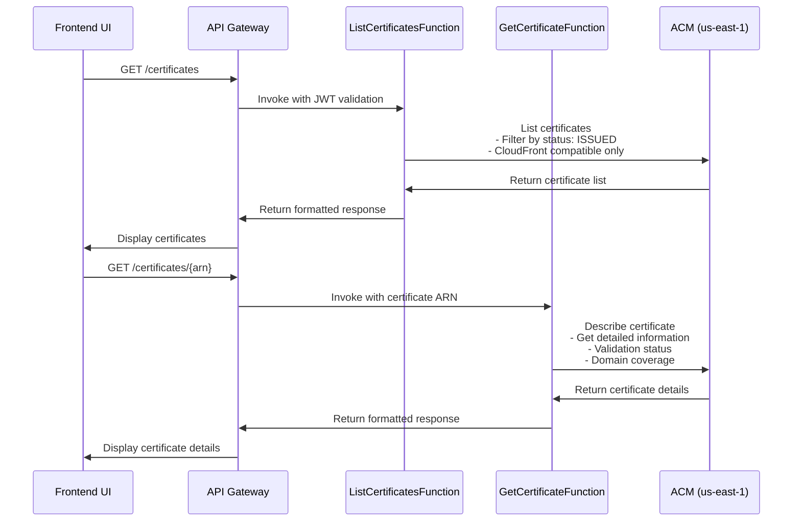

# 📚 CloudFront Manager - API Documentation

## 🏗️ **System Architecture Overview**

The CloudFront Manager is a comprehensive CDN management platform built on AWS serverless architecture with complete multi-origin Lambda@Edge functionality.

### **Base API URL**
```
https://20dnuxjzrd.execute-api.ap-northeast-1.amazonaws.com/api/
```

### **Authentication**
All API endpoints require **Cognito JWT authentication** via the `Authorization` header:
```
Authorization: Bearer <JWT_TOKEN>
```

## 📊 **API Architecture Diagram**

```mermaid
graph TB
    subgraph "Frontend Layer"
        UI[React SPA Frontend<br/>Static Files on S3<br/>Served via CloudFront]
        AUTH[Cognito Authentication<br/>JWT Token Management]
    end
    
    subgraph "API Gateway Layer"
        APIGW[API Gateway<br/>https://20dnuxjzrd.execute-api.ap-northeast-1.amazonaws.com/api/]
        CORS[CORS Configuration<br/>Cognito Authorizer]
    end
    
    subgraph "Lambda Functions Layer - Python Runtime"
        DIST_FUNCS[Distribution Functions]
        TMPL_FUNCS[Template Functions]
        ORIG_FUNCS[Origin Functions]
        CERT_FUNCS[Certificate Functions]
        EDGE_FUNCS[Lambda@Edge Functions]
    end
    
    subgraph "AWS Backend Services"
        CF[CloudFront API]
        S3[S3 API]
        ACM[Certificate Manager]
        LAMBDA[Lambda API<br/>us-east-1]
        DDB[DynamoDB Tables]
        SFN[Step Functions]
    end
    
    subgraph "Multi-Origin Infrastructure"
        EDGE_RUNTIME[Lambda@Edge Runtime<br/>Geographic Routing]
        OAI[Origin Access Identity]
        S3_ORIGINS[S3 Origins<br/>Multiple Regions]
    end

    UI --> AUTH
    UI --> APIGW
    AUTH --> APIGW
    APIGW --> CORS
    CORS --> DIST_FUNCS
    CORS --> TMPL_FUNCS
    CORS --> ORIG_FUNCS
    CORS --> CERT_FUNCS
    CORS --> EDGE_FUNCS
    
    DIST_FUNCS --> CF
    DIST_FUNCS --> DDB
    DIST_FUNCS --> LAMBDA
    DIST_FUNCS --> S3
    DIST_FUNCS --> SFN
    
    TMPL_FUNCS --> DDB
    ORIG_FUNCS --> S3
    ORIG_FUNCS --> DDB
    CERT_FUNCS --> ACM
    EDGE_FUNCS --> LAMBDA
    EDGE_FUNCS --> DDB
    
    CF --> EDGE_RUNTIME
    EDGE_RUNTIME --> OAI
    OAI --> S3_ORIGINS
```

## 🔗 **API Endpoint Overview**

| Category | Endpoints | Purpose |
|----------|-----------|---------|
| **Distributions** | `/distributions/*` | CloudFront distribution management |
| **Templates** | `/templates/*` | Reusable configuration templates |
| **Origins** | `/origins/*` | S3 origin management with OAC/OAI |
| **Certificates** | `/certificates/*` | SSL certificate management |
| **Lambda@Edge** | `/lambda-edge/*` | Multi-origin routing functions |

## 📋 **Common Response Format**

All API responses follow a consistent format:

### **Success Response**
```json
{
  "success": true,
  "data": {
    // Response data here
  },
  "message": "Operation completed successfully"
}
```

### **Error Response**
```json
{
  "success": false,
  "error": "Error description",
  "details": {
    "errorName": "SpecificErrorType",
    "additionalInfo": "..."
  }
}
```

## 🔒 **CORS Configuration**

All endpoints support CORS with the following configuration:
- **Allowed Origins**: `*`
- **Allowed Methods**: `GET, POST, PUT, DELETE, OPTIONS`
- **Allowed Headers**: `Content-Type, X-Amz-Date, Authorization, X-Api-Key, X-Amz-Security-Token`
- **Max Age**: 24 hours

---

# 📦 **Distribution Management APIs**

## **GET /distributions**
List all CloudFront distributions

### **Request**
```http
GET /distributions
Authorization: Bearer <JWT_TOKEN>
```

### **Response**
```json
{
  "success": true,
  "data": {
    "distributions": [
      {
        "id": "dist-12345",
        "name": "My Distribution",
        "cloudfrontId": "E1234567890123",
        "status": "Deployed",
        "domainName": "d1234567890123.cloudfront.net",
        "isMultiOrigin": false,
        "createdAt": "2025-07-08T10:00:00Z"
      }
    ]
  }
}
```

### **Lambda Function**: `ListDistributionsFunction`
### **AWS Services**: DynamoDB
### **Purpose**: Retrieve all distributions from DynamoDB table

---

## **POST /distributions**
Create a new CloudFront distribution

### **Request**
```http
POST /distributions
Authorization: Bearer <JWT_TOKEN>
Content-Type: application/json

{
  "name": "My New Distribution",
  "isMultiOrigin": false,
  "config": {
    "Comment": "My distribution comment",
    "Enabled": true,
    "Origins": {
      "Quantity": 1,
      "Items": [
        {
          "Id": "origin-1",
          "DomainName": "mybucket.s3.amazonaws.com",
          "S3OriginConfig": {
            "OriginAccessIdentity": ""
          }
        }
      ]
    },
    "DefaultCacheBehavior": {
      "TargetOriginId": "origin-1",
      "ViewerProtocolPolicy": "redirect-to-https"
    }
  }
}
```

### **Multi-Origin Request**
```json
{
  "name": "Global Multi-Origin Distribution",
  "isMultiOrigin": true,
  "multiOriginConfig": {
    "defaultOriginId": "origin-us-east-1",
    "additionalOriginIds": ["origin-eu-central-1", "origin-ap-southeast-1"],
    "preset": "global-3-region"
  },
  "config": {
    "Comment": "Multi-origin distribution with Lambda@Edge",
    "Enabled": true
  }
}
```

### **Response**
```json
{
  "success": true,
  "data": {
    "distribution": {
      "id": "dist-67890",
      "name": "My New Distribution",
      "cloudfrontId": "E9876543210987",
      "status": "InProgress",
      "domainName": "d9876543210987.cloudfront.net",
      "isMultiOrigin": false
    }
  },
  "message": "Distribution created successfully"
}
```

### **Lambda Function**: `CreateDistributionFunction`
### **AWS Services**: CloudFront, DynamoDB, Lambda (for multi-origin), S3, Step Functions
### **Purpose**: Create single-origin or multi-origin distributions with automatic Lambda@Edge setup

---

## **GET /distributions/{id}**
Get distribution details

### **Request**
```http
GET /distributions/dist-12345
Authorization: Bearer <JWT_TOKEN>
```

### **Response**
```json
{
  "success": true,
  "data": {
    "distribution": {
      "id": "dist-12345",
      "name": "My Distribution",
      "cloudfrontId": "E1234567890123",
      "status": "Deployed",
      "domainName": "d1234567890123.cloudfront.net",
      "arn": "arn:aws:cloudfront::123456789012:distribution/E1234567890123",
      "isMultiOrigin": true,
      "multiOriginConfig": {
        "defaultOriginId": "origin-us-east-1",
        "additionalOriginIds": ["origin-eu-central-1"],
        "preset": "global-3-region"
      },
      "lambdaEdgeFunctionId": "func-abc123",
      "oaiId": "E1URK07W5SXT02",
      "createdAt": "2025-07-08T10:00:00Z",
      "updatedAt": "2025-07-08T10:30:00Z"
    }
  }
}
```

### **Lambda Function**: `GetDistributionFunction`
### **AWS Services**: DynamoDB, CloudFront
### **Purpose**: Retrieve detailed distribution information

---

## **PUT /distributions/{id}**
Update distribution configuration

### **Request**
```http
PUT /distributions/dist-12345
Authorization: Bearer <JWT_TOKEN>
Content-Type: application/json

{
  "name": "Updated Distribution Name",
  "config": {
    "Comment": "Updated comment",
    "Enabled": true
  }
}
```

### **Response**
```json
{
  "success": true,
  "data": {
    "distribution": {
      "id": "dist-12345",
      "name": "Updated Distribution Name",
      "status": "InProgress"
    }
  },
  "message": "Distribution updated successfully"
}
```

### **Lambda Function**: `UpdateDistributionFunction`
### **AWS Services**: CloudFront, DynamoDB
### **Purpose**: Update distribution configuration and metadata

---

## **DELETE /distributions/{id}**
Delete a distribution

### **Request**
```http
DELETE /distributions/dist-12345
Authorization: Bearer <JWT_TOKEN>
```

### **Response**
```json
{
  "success": true,
  "message": "Distribution deleted successfully"
}
```

### **Lambda Function**: `DeleteDistributionFunction`
### **AWS Services**: CloudFront, DynamoDB, Lambda (cleanup), S3 (policy cleanup)
### **Purpose**: Delete distribution and cleanup associated resources (Lambda@Edge, OAI, S3 policies)

---

## **GET /distributions/{id}/status**
Get distribution deployment status

### **Request**
```http
GET /distributions/dist-12345/status
Authorization: Bearer <JWT_TOKEN>
```

### **Response**
```json
{
  "success": true,
  "data": {
    "status": "Deployed",
    "lastUpdated": "2025-07-08T10:30:00Z",
    "deploymentProgress": 100
  }
}
```

### **Lambda Function**: `GetDistributionStatusFunction`
### **AWS Services**: CloudFront, DynamoDB
### **Purpose**: Check current deployment status from CloudFront API

---

## **POST /distributions/{id}/invalidate**
Create cache invalidation

### **Request**
```http
POST /distributions/dist-12345/invalidate
Authorization: Bearer <JWT_TOKEN>
Content-Type: application/json

{
  "paths": ["/*", "/images/*"],
  "callerReference": "invalidation-2025-07-08-001"
}
```

### **Response**
```json
{
  "success": true,
  "data": {
    "invalidationId": "I1234567890123",
    "status": "InProgress",
    "paths": ["/*", "/images/*"]
  },
  "message": "Cache invalidation created successfully"
}
```

### **Lambda Function**: `InvalidateDistributionFunction`
### **AWS Services**: CloudFront, DynamoDB
### **Purpose**: Create CloudFront cache invalidation

---

# 📋 **Template Management APIs**

## **GET /templates**
List all configuration templates

### **Request**
```http
GET /templates
Authorization: Bearer <JWT_TOKEN>
```

### **Response**
```json
{
  "success": true,
  "data": {
    "templates": [
      {
        "templateId": "tmpl-001",
        "name": "Web Application Template",
        "category": "Web",
        "description": "Optimized for web applications",
        "features": ["Compression", "HTTPS", "Caching"],
        "createdAt": "2025-07-08T09:00:00Z"
      }
    ]
  }
}
```

### **Lambda Function**: `ListTemplatesFunction`
### **AWS Services**: DynamoDB
### **Purpose**: Retrieve all templates from DynamoDB

---

## **POST /templates**
Create a new template

### **Request**
```http
POST /templates
Authorization: Bearer <JWT_TOKEN>
Content-Type: application/json

{
  "name": "API Gateway Template",
  "category": "API",
  "description": "Optimized for API Gateway backends",
  "features": ["CORS", "Compression", "Low TTL"],
  "config": {
    "Comment": "API Gateway CDN Template",
    "Enabled": true,
    "DefaultCacheBehavior": {
      "ViewerProtocolPolicy": "redirect-to-https",
      "CachePolicyId": "4b690c29-d684-4924-a90c-454f84b39654"
    }
  }
}
```

### **Response**
```json
{
  "success": true,
  "data": {
    "template": {
      "templateId": "tmpl-002",
      "name": "API Gateway Template",
      "category": "API"
    }
  },
  "message": "Template created successfully"
}
```

### **Lambda Function**: `CreateTemplateFunction`
### **AWS Services**: DynamoDB
### **Purpose**: Create reusable distribution configuration template

---

## **GET /templates/{id}**
Get template details

### **Request**
```http
GET /templates/tmpl-001
Authorization: Bearer <JWT_TOKEN>
```

### **Response**
```json
{
  "success": true,
  "data": {
    "template": {
      "templateId": "tmpl-001",
      "name": "Web Application Template",
      "category": "Web",
      "description": "Optimized for web applications",
      "features": ["Compression", "HTTPS", "Caching"],
      "config": {
        "Comment": "Web Application CDN Template",
        "Enabled": true,
        "DefaultCacheBehavior": {
          "ViewerProtocolPolicy": "redirect-to-https",
          "CachePolicyId": "4b690c29-d684-4924-a90c-454f84b39654"
        }
      },
      "createdAt": "2025-07-08T09:00:00Z"
    }
  }
}
```

### **Lambda Function**: `GetTemplateFunction`
### **AWS Services**: DynamoDB
### **Purpose**: Retrieve detailed template configuration

---

## **PUT /templates/{id}**
Update template

### **Request**
```http
PUT /templates/tmpl-001
Authorization: Bearer <JWT_TOKEN>
Content-Type: application/json

{
  "name": "Updated Web Template",
  "description": "Enhanced web application template",
  "features": ["Compression", "HTTPS", "Caching", "WAF"]
}
```

### **Response**
```json
{
  "success": true,
  "data": {
    "template": {
      "templateId": "tmpl-001",
      "name": "Updated Web Template"
    }
  },
  "message": "Template updated successfully"
}
```

### **Lambda Function**: `UpdateTemplateFunction`
### **AWS Services**: DynamoDB
### **Purpose**: Update template configuration and metadata

---

## **DELETE /templates/{id}**
Delete template

### **Request**
```http
DELETE /templates/tmpl-001
Authorization: Bearer <JWT_TOKEN>
```

### **Response**
```json
{
  "success": true,
  "message": "Template deleted successfully"
}
```

### **Lambda Function**: `DeleteTemplateFunction`
### **AWS Services**: DynamoDB
### **Purpose**: Remove template from DynamoDB

---

## **POST /templates/{id}/apply**
Apply template to create distribution

### **Request**
```http
POST /templates/tmpl-001/apply
Authorization: Bearer <JWT_TOKEN>
Content-Type: application/json

{
  "name": "My New Distribution from Template",
  "originDomain": "mybucket.s3.amazonaws.com"
}
```

### **Response**
```json
{
  "success": true,
  "data": {
    "distribution": {
      "id": "dist-template-001",
      "name": "My New Distribution from Template",
      "status": "InProgress"
    }
  },
  "message": "Distribution created from template successfully"
}
```

### **Lambda Function**: `ApplyTemplateFunction`
### **AWS Services**: DynamoDB, CloudFront
### **Purpose**: Create distribution using template configuration

# 🎯 **Origin Management APIs**

## **GET /origins**
List all S3 origins

### **Request**
```http
GET /origins
Authorization: Bearer <JWT_TOKEN>
```

### **Response**
```json
{
  "success": true,
  "data": {
    "origins": [
      {
        "originId": "origin-12345",
        "name": "US East Origin",
        "bucketName": "my-content-bucket-us",
        "region": "us-east-1",
        "oacId": "E1234567890123",
        "websiteHosting": {
          "enabled": true,
          "indexDocument": "index.html",
          "errorDocument": "error.html"
        },
        "corsConfiguration": {
          "enabled": true,
          "allowedOrigins": ["*"],
          "allowedMethods": ["GET", "HEAD"]
        },
        "associatedDistributions": [
          "arn:aws:cloudfront::123456789012:distribution/E1234567890123"
        ],
        "createdAt": "2025-07-08T09:00:00Z"
      }
    ]
  }
}
```

### **Lambda Function**: `ListOriginsFunction`
### **AWS Services**: DynamoDB
### **Purpose**: Retrieve all S3 origins with their configurations and associations

---

## **POST /origins**
Create a new S3 origin with automatic OAC setup

### **Request**
```http
POST /origins
Authorization: Bearer <JWT_TOKEN>
Content-Type: application/json

{
  "name": "Europe Central Origin",
  "bucketName": "my-content-bucket-eu",
  "region": "eu-central-1",
  "websiteHosting": {
    "enabled": true,
    "indexDocument": "index.html",
    "errorDocument": "404.html"
  },
  "corsConfiguration": {
    "enabled": true,
    "allowedOrigins": ["https://mydomain.com"],
    "allowedMethods": ["GET", "HEAD", "OPTIONS"],
    "allowedHeaders": ["*"],
    "maxAgeSeconds": 3600
  }
}
```

### **Response**
```json
{
  "success": true,
  "data": {
    "origin": {
      "originId": "origin-67890",
      "name": "Europe Central Origin",
      "bucketName": "my-content-bucket-eu",
      "region": "eu-central-1",
      "oacId": "E9876543210987",
      "bucketUrl": "https://my-content-bucket-eu.s3.eu-central-1.amazonaws.com"
    }
  },
  "message": "S3 origin created successfully with OAC"
}
```

### **Lambda Function**: `CreateOriginFunction`
### **AWS Services**: S3, CloudFront (OAC), DynamoDB
### **Purpose**: Create S3 bucket with proper configuration and dedicated Origin Access Control

---

## **GET /origins/{id}**
Get origin details

### **Request**
```http
GET /origins/origin-12345
Authorization: Bearer <JWT_TOKEN>
```

### **Response**
```json
{
  "success": true,
  "data": {
    "origin": {
      "originId": "origin-12345",
      "name": "US East Origin",
      "bucketName": "my-content-bucket-us",
      "region": "us-east-1",
      "oacId": "E1234567890123",
      "websiteHosting": {
        "enabled": true,
        "indexDocument": "index.html",
        "errorDocument": "error.html"
      },
      "corsConfiguration": {
        "enabled": true,
        "allowedOrigins": ["*"],
        "allowedMethods": ["GET", "HEAD"],
        "allowedHeaders": ["*"],
        "maxAgeSeconds": 3600
      },
      "associatedDistributions": [
        "arn:aws:cloudfront::123456789012:distribution/E1234567890123"
      ],
      "bucketPolicy": {
        "hasOacAccess": true,
        "hasOaiAccess": false
      },
      "createdAt": "2025-07-08T09:00:00Z",
      "updatedAt": "2025-07-08T10:00:00Z"
    }
  }
}
```

### **Lambda Function**: `GetOriginFunction`
### **AWS Services**: DynamoDB
### **Purpose**: Retrieve detailed origin configuration and status

---

## **PUT /origins/{id}**
Update origin configuration

### **Request**
```http
PUT /origins/origin-12345
Authorization: Bearer <JWT_TOKEN>
Content-Type: application/json

{
  "name": "Updated US East Origin",
  "websiteHosting": {
    "enabled": true,
    "indexDocument": "home.html",
    "errorDocument": "404.html"
  },
  "corsConfiguration": {
    "enabled": true,
    "allowedOrigins": ["https://mydomain.com", "https://www.mydomain.com"],
    "allowedMethods": ["GET", "HEAD", "OPTIONS"],
    "allowedHeaders": ["Authorization", "Content-Type"],
    "maxAgeSeconds": 7200
  }
}
```

### **Response**
```json
{
  "success": true,
  "data": {
    "origin": {
      "originId": "origin-12345",
      "name": "Updated US East Origin"
    }
  },
  "message": "Origin updated successfully"
}
```

### **Lambda Function**: `UpdateOriginFunction`
### **AWS Services**: S3, DynamoDB
### **Purpose**: Update S3 bucket configuration and origin metadata

---

## **DELETE /origins/{id}**
Delete origin and cleanup resources

### **Request**
```http
DELETE /origins/origin-12345
Authorization: Bearer <JWT_TOKEN>
```

### **Response**
```json
{
  "success": true,
  "message": "Origin and associated resources deleted successfully"
}
```

### **Lambda Function**: `DeleteOriginFunction`
### **AWS Services**: S3, CloudFront (OAC cleanup), DynamoDB
### **Purpose**: Delete S3 bucket, remove OAC, and cleanup DynamoDB records

---

# 🔐 **Certificate Management APIs**

## **GET /certificates**
List SSL certificates from AWS Certificate Manager

### **Request**
```http
GET /certificates
Authorization: Bearer <JWT_TOKEN>
```

### **Response**
```json
{
  "success": true,
  "data": {
    "certificates": [
      {
        "certificateArn": "arn:aws:acm:us-east-1:123456789012:certificate/12345678-1234-1234-1234-123456789012",
        "domainName": "*.example.com",
        "subjectAlternativeNames": ["example.com", "www.example.com"],
        "status": "ISSUED",
        "type": "AMAZON_ISSUED",
        "keyAlgorithm": "RSA-2048",
        "keyUsages": ["DIGITAL_SIGNATURE", "KEY_ENCIPHERMENT"],
        "extendedKeyUsages": ["TLS_WEB_SERVER_AUTHENTICATION"],
        "createdAt": "2025-06-01T10:00:00Z",
        "issuedAt": "2025-06-01T10:30:00Z",
        "notBefore": "2025-06-01T00:00:00Z",
        "notAfter": "2026-06-01T23:59:59Z"
      }
    ]
  }
}
```

### **Lambda Function**: `ListCertificatesFunction`
### **AWS Services**: ACM (us-east-1)
### **Purpose**: List all SSL certificates available for CloudFront (must be in us-east-1)

---

## **GET /certificates/{arn}**
Get certificate details

### **Request**
```http
GET /certificates/arn:aws:acm:us-east-1:123456789012:certificate:12345678-1234-1234-1234-123456789012
Authorization: Bearer <JWT_TOKEN>
```

### **Response**
```json
{
  "success": true,
  "data": {
    "certificate": {
      "certificateArn": "arn:aws:acm:us-east-1:123456789012:certificate/12345678-1234-1234-1234-123456789012",
      "domainName": "*.example.com",
      "subjectAlternativeNames": ["example.com", "www.example.com"],
      "domainValidationOptions": [
        {
          "domainName": "*.example.com",
          "validationDomain": "example.com",
          "validationStatus": "SUCCESS",
          "validationMethod": "DNS"
        }
      ],
      "status": "ISSUED",
      "type": "AMAZON_ISSUED",
      "keyAlgorithm": "RSA-2048",
      "keyUsages": ["DIGITAL_SIGNATURE", "KEY_ENCIPHERMENT"],
      "extendedKeyUsages": ["TLS_WEB_SERVER_AUTHENTICATION"],
      "certificateTransparencyLoggingPreference": "ENABLED",
      "renewalEligibility": "ELIGIBLE",
      "serial": "01:23:45:67:89:ab:cd:ef",
      "subject": "CN=*.example.com",
      "issuer": "Amazon",
      "createdAt": "2025-06-01T10:00:00Z",
      "issuedAt": "2025-06-01T10:30:00Z",
      "notBefore": "2025-06-01T00:00:00Z",
      "notAfter": "2026-06-01T23:59:59Z"
    }
  }
}
```

### **Lambda Function**: `GetCertificateFunction`
### **AWS Services**: ACM (us-east-1)
### **Purpose**: Get detailed certificate information for CloudFront configuration

---

# ⚡ **Lambda@Edge Management APIs**

## **GET /lambda-edge/functions**
List Lambda@Edge functions

### **Request**
```http
GET /lambda-edge/functions
Authorization: Bearer <JWT_TOKEN>
```

### **Response**
```json
{
  "success": true,
  "data": {
    "functions": [
      {
        "functionId": "func-12345",
        "functionName": "demo50-multi-origin-func-abc123",
        "functionArn": "arn:aws:lambda:us-east-1:123456789012:function:demo50-multi-origin-func-abc123",
        "versionArn": "arn:aws:lambda:us-east-1:123456789012:function:demo50-multi-origin-func-abc123:1",
        "status": "Active",
        "preset": "global-3-region",
        "origins": {
          "default": {
            "originId": "origin-us-east-1",
            "region": "us-east-1",
            "bucketName": "content-bucket-us"
          },
          "additional": [
            {
              "originId": "origin-eu-central-1",
              "region": "eu-central-1",
              "bucketName": "content-bucket-eu"
            }
          ]
        },
        "createdAt": "2025-07-08T10:00:00Z",
        "createdBy": "user@example.com"
      }
    ]
  }
}
```

### **Lambda Function**: `ListLambdaEdgeFunctionsFunction`
### **AWS Services**: DynamoDB
### **Purpose**: List all Lambda@Edge functions with their configurations

---

## **POST /lambda-edge/functions**
Create Lambda@Edge function

### **Request**
```http
POST /lambda-edge/functions
Authorization: Bearer <JWT_TOKEN>
Content-Type: application/json

{
  "name": "custom-routing-function",
  "preset": "geographic",
  "origins": {
    "default": {
      "originId": "origin-us-east-1",
      "region": "us-east-1",
      "bucketName": "content-bucket-us"
    },
    "additional": [
      {
        "originId": "origin-eu-central-1",
        "region": "eu-central-1",
        "bucketName": "content-bucket-eu"
      },
      {
        "originId": "origin-ap-southeast-1",
        "region": "ap-southeast-1",
        "bucketName": "content-bucket-sg"
      }
    ]
  }
}
```

### **Response**
```json
{
  "success": true,
  "data": {
    "function": {
      "functionId": "func-67890",
      "functionName": "custom-routing-function-def456",
      "functionArn": "arn:aws:lambda:us-east-1:123456789012:function:custom-routing-function-def456",
      "versionArn": "arn:aws:lambda:us-east-1:123456789012:function:custom-routing-function-def456:1",
      "status": "Active"
    }
  },
  "message": "Lambda@Edge function created successfully"
}
```

### **Lambda Function**: `CreateLambdaEdgeFunctionFunction`
### **AWS Services**: Lambda (us-east-1), DynamoDB
### **Purpose**: Create standalone Lambda@Edge function with geographic routing logic

---

## **GET /lambda-edge/functions/{id}**
Get Lambda@Edge function details

### **Request**
```http
GET /lambda-edge/functions/func-12345
Authorization: Bearer <JWT_TOKEN>
```

### **Response**
```json
{
  "success": true,
  "data": {
    "function": {
      "functionId": "func-12345",
      "functionName": "demo50-multi-origin-func-abc123",
      "functionArn": "arn:aws:lambda:us-east-1:123456789012:function:demo50-multi-origin-func-abc123",
      "versionArn": "arn:aws:lambda:us-east-1:123456789012:function:demo50-multi-origin-func-abc123:1",
      "status": "Active",
      "preset": "global-3-region",
      "codeSize": 2048,
      "timeout": 5,
      "memorySize": 128,
      "runtime": "nodejs18.x",
      "origins": {
        "default": {
          "originId": "origin-us-east-1",
          "region": "us-east-1",
          "bucketName": "content-bucket-us"
        },
        "additional": [
          {
            "originId": "origin-eu-central-1",
            "region": "eu-central-1",
            "bucketName": "content-bucket-eu"
          }
        ]
      },
      "associatedDistributions": [
        "arn:aws:cloudfront::123456789012:distribution/E1234567890123"
      ],
      "createdAt": "2025-07-08T10:00:00Z",
      "updatedAt": "2025-07-08T10:30:00Z",
      "createdBy": "user@example.com"
    }
  }
}
```

### **Lambda Function**: `GetLambdaEdgeFunctionFunction`
### **AWS Services**: DynamoDB, Lambda (us-east-1)
### **Purpose**: Get detailed Lambda@Edge function information and status

---

## **POST /lambda-edge/preview**
Preview generated Lambda@Edge function code

### **Request**
```http
POST /lambda-edge/preview
Authorization: Bearer <JWT_TOKEN>
Content-Type: application/json

{
  "preset": "geographic",
  "origins": {
    "default": {
      "originId": "origin-us-east-1",
      "region": "us-east-1",
      "bucketName": "content-bucket-us"
    },
    "additional": [
      {
        "originId": "origin-eu-central-1",
        "region": "eu-central-1",
        "bucketName": "content-bucket-eu"
      }
    ]
  }
}
```

### **Response**
```json
{
  "success": true,
  "data": {
    "functionCode": "exports.handler = async (event) => {\n    const request = event.Records[0].cf.request;\n    const headers = request.headers;\n    \n    // Origin mapping configuration\n    const origins = {\n        \"origin-us-east-1\": {\n            \"domainName\": \"content-bucket-us.s3.us-east-1.amazonaws.com\",\n            \"region\": \"us-east-1\",\n            \"bucketName\": \"content-bucket-us\"\n        },\n        \"origin-eu-central-1\": {\n            \"domainName\": \"content-bucket-eu.s3.eu-central-1.amazonaws.com\",\n            \"region\": \"eu-central-1\",\n            \"bucketName\": \"content-bucket-eu\"\n        }\n    };\n    \n    // Geographic routing logic...\n    return request;\n};",
    "preset": "geographic",
    "originCount": 2,
    "estimatedSize": 2048
  }
}
```

### **Lambda Function**: `PreviewLambdaEdgeFunctionFunction`
### **AWS Services**: None (code generation only)
### **Purpose**: Generate and preview Lambda@Edge function code without creating the function

---

# 🔄 **API Flow Examples**

## **Multi-Origin Distribution Creation Flow**

```mermaid
sequenceDiagram
    participant UI as Frontend UI
    participant API as API Gateway
    participant CREATE as CreateDistributionFunction
    participant CF as CloudFront API
    participant LAMBDA as Lambda API (us-east-1)
    participant S3 as S3 API
    participant DDB as DynamoDB

    UI->>API: POST /distributions<br/>{isMultiOrigin: true, multiOriginConfig: {...}}
    API->>CREATE: Invoke with JWT validation
    
    CREATE->>DDB: Validate origins exist
    CREATE->>CF: Create Origin Access Identity (OAI)
    CREATE->>LAMBDA: Create Lambda@Edge function<br/>- Generate JavaScript code<br/>- Create ZIP package<br/>- Deploy to us-east-1<br/>- Add CloudFront permissions
    CREATE->>CF: Create CloudFront distribution<br/>- Associate Lambda@Edge function<br/>- Configure multiple origins<br/>- Set up OAI authentication
    CREATE->>S3: Update bucket policies<br/>- Add OAI permissions<br/>- Support multiple OAI principals
    CREATE->>DDB: Store distribution metadata<br/>- Lambda@Edge function ID<br/>- OAI ID<br/>- Multi-origin configuration
    
    CREATE->>API: Return success response
    API->>UI: Distribution created successfully
```

## **Origin Creation with OAC Flow**

```mermaid
sequenceDiagram
    participant UI as Frontend UI
    participant API as API Gateway
    participant CREATE as CreateOriginFunction
    participant S3 as S3 API
    participant CF as CloudFront API
    participant DDB as DynamoDB

    UI->>API: POST /origins<br/>{name, bucketName, region, config}
    API->>CREATE: Invoke with JWT validation
    
    CREATE->>S3: Create S3 bucket<br/>- Configure website hosting<br/>- Set CORS configuration<br/>- Apply bucket policies
    CREATE->>CF: Create Origin Access Control (OAC)<br/>- Generate unique OAC for bucket<br/>- Configure S3 access permissions
    CREATE->>DDB: Store origin metadata<br/>- Origin configuration<br/>- OAC association<br/>- Creation timestamp
    
    CREATE->>API: Return success response
    API->>UI: Origin created with OAC
```

## **Certificate Integration Flow**



---

# 🔧 **Error Handling**

## **Common Error Codes**

| HTTP Status | Error Type | Description |
|-------------|------------|-------------|
| `400` | Bad Request | Invalid request parameters or malformed JSON |
| `401` | Unauthorized | Missing or invalid JWT token |
| `403` | Forbidden | Insufficient permissions for the operation |
| `404` | Not Found | Resource not found (distribution, template, origin) |
| `409` | Conflict | Resource already exists or conflicting state |
| `429` | Too Many Requests | Rate limit exceeded |
| `500` | Internal Server Error | AWS service error or Lambda function failure |
| `503` | Service Unavailable | AWS service temporarily unavailable |

## **Error Response Examples**

### **Authentication Error**
```json
{
  "success": false,
  "error": "Unauthorized access",
  "details": {
    "errorName": "UnauthorizedError",
    "message": "JWT token is missing or invalid"
  }
}
```

### **AWS Service Error**
```json
{
  "success": false,
  "error": "Failed to create CloudFront distribution",
  "details": {
    "errorName": "InvalidArgument",
    "message": "The specified origin domain name is not valid",
    "awsErrorCode": "InvalidArgument"
  }
}
```

### **Resource Not Found**
```json
{
  "success": false,
  "error": "Distribution not found",
  "details": {
    "errorName": "ResourceNotFound",
    "resourceId": "dist-12345",
    "resourceType": "distribution"
  }
}
```

---

# 📊 **Rate Limits and Quotas**

## **API Gateway Limits**
- **Requests per second**: 10,000 (default)
- **Burst capacity**: 5,000 requests
- **Payload size**: 10 MB maximum

## **AWS Service Limits**
- **CloudFront distributions**: 200 per account (can be increased)
- **Lambda@Edge functions**: 25 per region
- **S3 buckets**: 100 per account (soft limit)
- **ACM certificates**: 2,048 per account per region

## **Best Practices**
- Implement exponential backoff for retries
- Cache frequently accessed data (templates, certificates)
- Use pagination for large result sets
- Monitor CloudWatch metrics for performance optimization

---

# 🔐 **Security Considerations**

## **Authentication & Authorization**
- All endpoints require valid Cognito JWT tokens
- Tokens expire after 24 hours (configurable)
- Role-based access control via Cognito groups
- API Gateway request validation and throttling

## **Data Protection**
- All API communication over HTTPS/TLS 1.2+
- Sensitive data encrypted at rest in DynamoDB
- S3 bucket policies restrict access to CloudFront OAC/OAI
- Lambda@Edge functions use least privilege IAM roles

## **Network Security**
- API Gateway deployed with AWS WAF protection
- CloudFront distributions use security headers
- Origin Access Control prevents direct S3 access
- VPC endpoints for internal AWS service communication

---

# 📈 **Monitoring and Observability**

## **CloudWatch Metrics**
- API Gateway request/response metrics
- Lambda function execution metrics
- CloudFront distribution performance
- DynamoDB read/write capacity metrics

## **Logging**
- API Gateway access logs
- Lambda function execution logs
- Lambda@Edge regional execution logs
- CloudTrail API audit logs

## **Alerting**
- High error rate alerts
- Lambda function timeout alerts
- CloudFront distribution deployment failures
- DynamoDB throttling alerts

---

## **InvalidateDistributionFunction**

### **1. CloudFront - CreateInvalidation (Create Cache Invalidation)**
**📖 Boto3 Documentation**: [CloudFront.Client.create_invalidation](https://boto3.amazonaws.com/v1/documentation/api/latest/reference/services/cloudfront.html#CloudFront.Client.create_invalidation)

```python
# Input Structure
{
    "DistributionId": "E1234567890123",
    "InvalidationBatch": {
        "Paths": {
            "Quantity": 2,
            "Items": ["/*", "/images/*"]
        },
        "CallerReference": "invalidation-2025-07-08-001"
    }
}

# Output Structure
{
    "Location": "https://cloudfront.amazonaws.com/2020-05-31/distribution/E1234567890123/invalidation/I1234567890123",
    "Invalidation": {
        "Id": "I1234567890123",
        "Status": "InProgress",
        "CreateTime": "2025-07-08T10:00:00Z",
        "InvalidationBatch": {
            "Paths": {
                "Quantity": 2,
                "Items": ["/*", "/images/*"]
            },
            "CallerReference": "invalidation-2025-07-08-001"
        }
    }
}
```
**Description**: Invalidates CloudFront cache for specified paths to serve fresh content

### **2. DynamoDB - PutItem (Store Invalidation History)**
**📖 Boto3 Documentation**: [DynamoDB.Client.put_item](https://boto3.amazonaws.com/v1/documentation/api/latest/reference/services/dynamodb.html#DynamoDB.Client.put_item)

```python
# Input Structure
{
    "TableName": "history-table-name",
    "Item": {
        "recordId": "inv-hist-12345",
        "distributionId": "dist-12345",
        "action": "create_invalidation",
        "timestamp": "2025-07-08T10:00:00Z",
        "details": {
            "invalidationId": "I1234567890123",
            "paths": ["/*", "/images/*"],
            "status": "InProgress"
        }
    }
}

# Output Structure (Empty response on success)
{}
```
**Description**: Stores cache invalidation operation history in DynamoDB

---

## **ListTemplatesFunction**

### **1. DynamoDB - Scan (Retrieve All Templates)**
**📖 Boto3 Documentation**: [DynamoDB.Client.scan](https://boto3.amazonaws.com/v1/documentation/api/latest/reference/services/dynamodb.html#DynamoDB.Client.scan)

```python
# Input Structure
{
    "TableName": "templates-table-name",
    "FilterExpression": "attribute_exists(templateId)"
}

# Output Structure
{
    "Items": [
        {
            "templateId": "tmpl-001",
            "name": "Web Application Template",
            "category": "Web",
            "description": "Optimized for web applications",
            "features": ["Compression", "HTTPS", "Caching"],
            "config": {
                "Comment": "Web Application CDN Template",
                "Enabled": True,
                "DefaultCacheBehavior": {
                    "ViewerProtocolPolicy": "redirect-to-https"
                }
            },
            "createdAt": "2025-07-08T09:00:00Z"
        }
    ],
    "Count": 1,
    "ScannedCount": 1
}
```
**Description**: Scans DynamoDB for all template records and returns the list

---

## **CreateTemplateFunction**

### **1. DynamoDB - PutItem (Store New Template)**
**📖 Boto3 Documentation**: [DynamoDB.Client.put_item](https://boto3.amazonaws.com/v1/documentation/api/latest/reference/services/dynamodb.html#DynamoDB.Client.put_item)

```python
# Input Structure
{
    "TableName": "templates-table-name",
    "Item": {
        "templateId": "tmpl-002",
        "name": "API Gateway Template",
        "category": "API",
        "description": "Optimized for API Gateway backends",
        "features": ["CORS", "Compression", "Low TTL"],
        "config": {
            "Comment": "API Gateway CDN Template",
            "Enabled": True,
            "DefaultCacheBehavior": {
                "ViewerProtocolPolicy": "redirect-to-https",
                "CachePolicyId": "4b690c29-d684-4924-a90c-454f84b39654"
            }
        },
        "createdAt": "2025-07-08T10:00:00Z",
        "createdBy": "user@example.com"
    }
}

# Output Structure (Empty response on success)
{}
```
**Description**: Stores a new reusable distribution configuration template in DynamoDB

---

## **ApplyTemplateFunction**

### **1. DynamoDB - GetItem (Retrieve Template Configuration)**
**📖 Boto3 Documentation**: [DynamoDB.Client.get_item](https://boto3.amazonaws.com/v1/documentation/api/latest/reference/services/dynamodb.html#DynamoDB.Client.get_item)

```python
# Input Structure
{
    "TableName": "templates-table-name",
    "Key": {
        "templateId": "tmpl-001"
    }
}

# Output Structure
{
    "Item": {
        "templateId": "tmpl-001",
        "name": "Web Application Template",
        "config": {
            "Comment": "Web Application CDN Template",
            "Enabled": True,
            "DefaultCacheBehavior": {
                "ViewerProtocolPolicy": "redirect-to-https",
                "CachePolicyId": "4b690c29-d684-4924-a90c-454f84b39654"
            }
        }
    }
}
```
**Description**: Retrieves template configuration information from DynamoDB for application

### **2. Lambda - InvokeFunction (Call CreateDistribution Function)**
**📖 Boto3 Documentation**: [Lambda.Client.invoke](https://boto3.amazonaws.com/v1/documentation/api/latest/reference/services/lambda.html#Lambda.Client.invoke)

```python
# Input Structure
{
    "FunctionName": "CreateDistributionFunction",
    "InvocationType": "RequestResponse",
    "Payload": "{\"name\":\"My New Distribution from Template\",\"config\":{\"Comment\":\"Web Application CDN Template\",\"Enabled\":true,\"DefaultCacheBehavior\":{\"ViewerProtocolPolicy\":\"redirect-to-https\"}},\"originDomain\":\"mybucket.s3.amazonaws.com\"}"
}

# Output Structure
{
    "StatusCode": 200,
    "Payload": "{\"success\":true,\"data\":{\"distribution\":{\"id\":\"dist-template-001\",\"name\":\"My New Distribution from Template\",\"status\":\"InProgress\"}}}"
}
```
**Description**: Invokes CreateDistribution function using template configuration to create new distribution

---

## **GetDistributionStatusFunction**

### **1. CloudFront - GetDistribution (Real-time Status Check)**
**📖 Boto3 Documentation**: [CloudFront.Client.get_distribution](https://boto3.amazonaws.com/v1/documentation/api/latest/reference/services/cloudfront.html#CloudFront.Client.get_distribution)

```python
# Input Structure
{
    "Id": "E1234567890123"
}

# Output Structure
{
    "Distribution": {
        "Id": "E1234567890123",
        "Status": "Deployed",
        "LastModifiedTime": "2025-07-08T10:30:00Z",
        "DistributionConfig": {
            "Enabled": True
        }
    }
}
```
**Description**: Retrieves current distribution status in real-time from CloudFront API

### **2. DynamoDB - UpdateItem (Update on Status Change)**
**📖 Boto3 Documentation**: [DynamoDB.Client.update_item](https://boto3.amazonaws.com/v1/documentation/api/latest/reference/services/dynamodb.html#DynamoDB.Client.update_item)

```python
# Input Structure
{
    "TableName": "distributions-table-name",
    "Key": {
        "distributionId": "dist-12345"
    },
    "UpdateExpression": "SET #status = :status, updatedAt = :updatedAt",
    "ExpressionAttributeNames": {
        "#status": "status"
    },
    "ExpressionAttributeValues": {
        ":status": "Deployed",
        ":updatedAt": "2025-07-08T10:30:00Z"
    }
}

# Output Structure
{
    "Attributes": {
        "distributionId": "dist-12345",
        "status": "Deployed",
        "updatedAt": "2025-07-08T10:30:00Z"
    }
}
```
**Description**: Updates distribution record in DynamoDB when status changes

---

## **FindPendingDistributionsFunction**

### **1. DynamoDB - Scan (Find Pending Distributions)**
**📖 Boto3 Documentation**: [DynamoDB.Client.scan](https://boto3.amazonaws.com/v1/documentation/api/latest/reference/services/dynamodb.html#DynamoDB.Client.scan)

```python
# Input Structure
{
    "TableName": "distributions-table-name",
    "FilterExpression": "#status IN (:creating, :inprogress)",
    "ExpressionAttributeNames": {
        "#status": "status"
    },
    "ExpressionAttributeValues": {
        ":creating": "Creating",
        ":inprogress": "InProgress"
    }
}

# Output Structure
{
    "Items": [
        {
            "distributionId": "dist-12345",
            "cloudfrontId": "E1234567890123",
            "status": "InProgress",
            "createdAt": "2025-07-08T10:00:00Z"
        },
        {
            "distributionId": "dist-67890",
            "cloudfrontId": "E9876543210987",
            "status": "Creating",
            "createdAt": "2025-07-08T10:15:00Z"
        }
    ],
    "Count": 2
}
```
**Description**: Searches DynamoDB for pending distributions that need status monitoring

### **2. Lambda - InvokeFunction (Call Status Check Function)**
**📖 Boto3 Documentation**: [Lambda.Client.invoke](https://boto3.amazonaws.com/v1/documentation/api/latest/reference/services/lambda.html#Lambda.Client.invoke)

```python
# Input Structure
{
    "FunctionName": "CheckDeploymentStatusFunction",
    "InvocationType": "Event",
    "Payload": "{\"distributionId\":\"dist-12345\",\"cloudfrontId\":\"E1234567890123\"}"
}

# Output Structure
{
    "StatusCode": 202
}
```
**Description**: Asynchronously invokes status check function for each pending distribution

---

## **UpdateOriginFunction**

### **1. DynamoDB - UpdateItem (Update Origin Metadata)**
**📖 Boto3 Documentation**: [DynamoDB.Client.update_item](https://boto3.amazonaws.com/v1/documentation/api/latest/reference/services/dynamodb.html#DynamoDB.Client.update_item)

```python
# Input Structure
{
    "TableName": "origins-table-name",
    "Key": {
        "originId": "origin-12345"
    },
    "UpdateExpression": "SET #name = :name, websiteHosting = :websiteHosting, corsConfiguration = :corsConfiguration, updatedAt = :updatedAt",
    "ExpressionAttributeNames": {
        "#name": "name"
    },
    "ExpressionAttributeValues": {
        ":name": "Updated US East Origin",
        ":websiteHosting": {
            "enabled": True,
            "indexDocument": "home.html",
            "errorDocument": "404.html"
        },
        ":corsConfiguration": {
            "enabled": True,
            "allowedOrigins": ["https://mydomain.com", "https://www.mydomain.com"],
            "allowedMethods": ["GET", "HEAD", "OPTIONS"]
        },
        ":updatedAt": "2025-07-08T11:00:00Z"
    }
}

# Output Structure
{
    "Attributes": {
        "originId": "origin-12345",
        "name": "Updated US East Origin",
        "updatedAt": "2025-07-08T11:00:00Z"
    }
}
```
**Description**: Updates origin metadata information in DynamoDB

### **2. S3 - PutBucketWebsite (Update Website Hosting Configuration)**
**📖 Boto3 Documentation**: [S3.Client.put_bucket_website](https://boto3.amazonaws.com/v1/documentation/api/latest/reference/services/s3.html#S3.Client.put_bucket_website)

```python
# Input Structure
{
    "Bucket": "my-content-bucket-us",
    "WebsiteConfiguration": {
        "IndexDocument": {
            "Suffix": "home.html"
        },
        "ErrorDocument": {
            "Key": "404.html"
        }
    }
}

# Output Structure (Empty response on success)
{}
```
**Description**: Updates S3 bucket website hosting configuration with new settings

### **3. S3 - PutBucketCORS (Update CORS Configuration)**
**📖 Boto3 Documentation**: [S3.Client.put_bucket_cors](https://boto3.amazonaws.com/v1/documentation/api/latest/reference/services/s3.html#S3.Client.put_bucket_cors)

```python
# Input Structure
{
    "Bucket": "my-content-bucket-us",
    "CORSConfiguration": {
        "CORSRules": [
            {
                "AllowedHeaders": ["Authorization", "Content-Type"],
                "AllowedMethods": ["GET", "HEAD", "OPTIONS"],
                "AllowedOrigins": ["https://mydomain.com", "https://www.mydomain.com"],
                "MaxAgeSeconds": 7200
            }
        ]
    }
}

# Output Structure (Empty response on success)
{}
```
**Description**: Updates S3 bucket CORS policy with new configuration settings

---

## **DeleteOriginFunction**

### **1. DynamoDB - GetItem (Retrieve Origin Information)**
**📖 Boto3 Documentation**: [DynamoDB.Client.get_item](https://boto3.amazonaws.com/v1/documentation/api/latest/reference/services/dynamodb.html#DynamoDB.Client.get_item)

```python
# Input Structure
{
    "TableName": "origins-table-name",
    "Key": {
        "originId": "origin-12345"
    }
}

# Output Structure
{
    "Item": {
        "originId": "origin-12345",
        "bucketName": "my-content-bucket-us",
        "region": "us-east-1",
        "oacId": "E1234567890123",
        "associatedDistributions": []
    }
}
```
**Description**: Retrieves origin information for deletion (check associated distributions and identify resources to clean up)

### **2. S3 - ListObjects (Check Bucket Contents)**
**📖 Boto3 Documentation**: [S3.Client.list_objects_v2](https://boto3.amazonaws.com/v1/documentation/api/latest/reference/services/s3.html#S3.Client.list_objects_v2)

```python
# Input Structure
{
    "Bucket": "my-content-bucket-us",
    "MaxKeys": 1
}

# Output Structure
{
    "Contents": [],
    "IsTruncated": False
}
```
**Description**: Checks if S3 bucket is empty (objects must be deleted if not empty)

### **3. S3 - DeleteObject (Delete Bucket Objects)**
**📖 Boto3 Documentation**: [S3.Client.delete_object](https://boto3.amazonaws.com/v1/documentation/api/latest/reference/services/s3.html#S3.Client.delete_object)

```python
# Input Structure (if bucket contains objects)
{
    "Bucket": "my-content-bucket-us",
    "Key": "index.html"
}

# Output Structure
{
    "DeleteMarker": False,
    "VersionId": "null"
}
```
**Description**: Deletes all objects from bucket before bucket deletion

### **4. S3 - DeleteBucket (Delete S3 Bucket)**
**📖 Boto3 Documentation**: [S3.Client.delete_bucket](https://boto3.amazonaws.com/v1/documentation/api/latest/reference/services/s3.html#S3.Client.delete_bucket)

```python
# Input Structure
{
    "Bucket": "my-content-bucket-us"
}

# Output Structure (Empty response on success)
{}
```
**Description**: Completely deletes the empty S3 bucket

### **5. CloudFront - DeleteOriginAccessControl (Delete Associated OAC)**
**📖 Boto3 Documentation**: [CloudFront.Client.delete_origin_access_control](https://boto3.amazonaws.com/v1/documentation/api/latest/reference/services/cloudfront.html#CloudFront.Client.delete_origin_access_control)

```python
# Input Structure
{
    "Id": "E1234567890123"
}

# Output Structure (Empty response on success)
{}
```
**Description**: Deletes the Origin Access Control associated with the origin

### **6. DynamoDB - DeleteItem (Delete Origin Record)**
**📖 Boto3 Documentation**: [DynamoDB.Client.delete_item](https://boto3.amazonaws.com/v1/documentation/api/latest/reference/services/dynamodb.html#DynamoDB.Client.delete_item)

```python
# Input Structure
{
    "TableName": "origins-table-name",
    "Key": {
        "originId": "origin-12345"
    }
}

# Output Structure (Empty response on success)
{}
```
**Description**: Completely removes origin metadata record from DynamoDB

---

## **GetCertificateFunction**

### **1. ACM - DescribeCertificate (Retrieve Certificate Details)**
**📖 Boto3 Documentation**: [ACM.Client.describe_certificate](https://boto3.amazonaws.com/v1/documentation/api/latest/reference/services/acm.html#ACM.Client.describe_certificate)

```python
# Input Structure
{
    "CertificateArn": "arn:aws:acm:us-east-1:123456789012:certificate/12345678-1234-1234-1234-123456789012"
}

# Output Structure
{
    "Certificate": {
        "CertificateArn": "arn:aws:acm:us-east-1:123456789012:certificate/12345678-1234-1234-1234-123456789012",
        "DomainName": "*.example.com",
        "SubjectAlternativeNames": ["example.com", "www.example.com"],
        "DomainValidationOptions": [
            {
                "DomainName": "*.example.com",
                "ValidationDomain": "example.com",
                "ValidationStatus": "SUCCESS",
                "ValidationMethod": "DNS",
                "ResourceRecord": {
                    "Name": "_abc123def456.example.com",
                    "Type": "CNAME",
                    "Value": "_xyz789abc123.acm-validations.aws."
                }
            }
        ],
        "Status": "ISSUED",
        "Type": "AMAZON_ISSUED",
        "KeyAlgorithm": "RSA-2048",
        "KeyUsages": ["DIGITAL_SIGNATURE", "KEY_ENCIPHERMENT"],
        "ExtendedKeyUsages": ["TLS_WEB_SERVER_AUTHENTICATION"],
        "CertificateTransparencyLoggingPreference": "ENABLED",
        "RenewalEligibility": "ELIGIBLE",
        "Serial": "01:23:45:67:89:ab:cd:ef",
        "Subject": "CN=*.example.com",
        "Issuer": "Amazon",
        "CreatedAt": "2025-06-01T10:00:00Z",
        "IssuedAt": "2025-06-01T10:30:00Z",
        "NotBefore": "2025-06-01T00:00:00Z",
        "NotAfter": "2026-06-01T23:59:59Z"
    }
}
```
**Description**: Retrieves detailed information about SSL certificate with specified ARN (includes domain validation status, expiration date, etc.)

---

## **PreviewLambdaEdgeFunctionFunction**

### **No AWS API Calls**
```python
# This function does not make AWS API calls
# It only performs pure JavaScript code generation

# Input Processing
request_data = {
    "preset": "geographic",
    "origins": {
        "default": {
            "originId": "origin-us-east-1",
            "region": "us-east-1",
            "bucketName": "content-bucket-us"
        },
        "additional": [
            {
                "originId": "origin-eu-central-1", 
                "region": "eu-central-1",
                "bucketName": "content-bucket-eu"
            }
        ]
    }
}

# Output (Generated JavaScript Code)
{
    "success": True,
    "data": {
        "functionCode": "exports.handler = async (event) => { /* generated code */ }",
        "preset": "geographic",
        "originCount": 2,
        "estimatedSize": 2048
    }
}
```
**Description**: Generates Lambda@Edge function code and provides preview without making AWS API calls

---

### **Step Functions Permissions**
```json
{
  "Effect": "Allow",
  "Action": [
    "states:StartExecution"
  ],
  "Resource": "*"
}
```

## **📊 AWS API Usage Pattern Analysis**

### **Most Frequently Used AWS APIs**
1. **DynamoDB PutItem/GetItem/UpdateItem** - Data storage and retrieval (25 times)
2. **CloudFront GetDistribution** - Distribution status checking (8 times)
3. **S3 PutBucketPolicy** - Bucket policy management (6 times)
4. **Lambda CreateFunction** - Lambda@Edge function creation (4 times)
5. **CloudFront CreateDistribution** - New distribution creation (3 times)

### **Regional API Call Distribution**
- **us-east-1**: CloudFront, Lambda@Edge, ACM (global services and special requirements)
- **ap-northeast-1**: DynamoDB, Step Functions (primary application region)
- **User-selected regions**: S3 (origin-specific optimization)

### **Error Handling Patterns**
All Lambda functions use consistent error handling patterns:

```python
try:
    # AWS API call
    result = aws_client.api_call(parameters)
    return cors_response(200, {"success": True, "data": result})
except ClientError as e:
    error_code = e.response['Error']['Code']
    error_message = e.response['Error']['Message']
    logger.error(f"AWS API Error: {error_code} - {error_message}")
    return cors_response(400, {"success": False, "error": error_message})
except Exception as e:
    logger.error(f"Unexpected error: {str(e)}")
    return cors_response(500, {"success": False, "error": "Internal server error"})
```

This comprehensive API documentation covers all endpoints, request/response formats, Lambda functions, AWS service integrations, and operational considerations for the CloudFront Manager platform.
