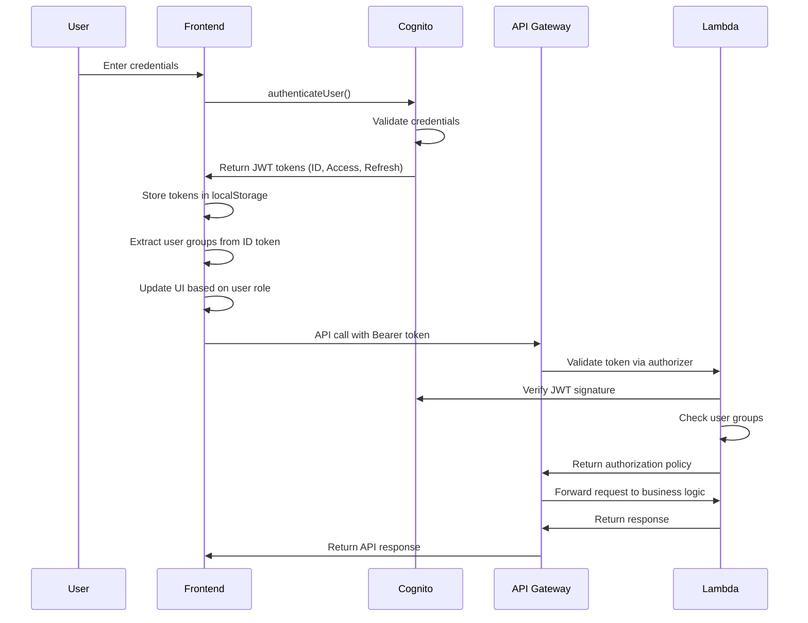
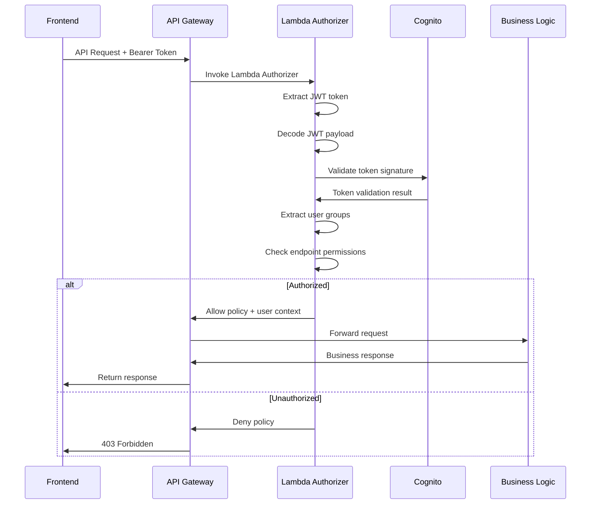

# CloudFront Manager Authentication Architecture

## Overview

The CloudFront Manager implements a comprehensive authentication and authorization system using AWS Cognito User Pools with role-based access control. The system provides secure, scalable authentication with 1-hour token expiration and group-based permissions.

## Architecture Components

### 1. **AWS Cognito User Pool**
- **Primary Authentication**: Handles user registration, login, and token management
- **User Groups**: Implements role-based access control (Administrators vs Regular Users)
- **Token Management**: Issues JWT tokens with 1-hour expiration for enhanced security
- **Password Policy**: Enforces strong password requirements (12+ chars, mixed case, numbers, symbols)

### 2. **Frontend Authentication (Vanilla JavaScript)**
- **Cognito SDK Integration**: Uses `amazon-cognito-identity-js` for client-side authentication
- **Token Storage**: Stores JWT tokens in localStorage with automatic expiration handling
- **Role Detection**: Extracts user groups from JWT tokens for UI customization
- **Session Management**: Implements automatic token validation and expiration handling

### 3. **API Gateway Authorization**
- **Dual Authorizer System**: Uses both Cognito and Lambda authorizers for different endpoints
- **CORS Support**: Comprehensive CORS configuration for cross-origin requests
- **Request Validation**: Validates all incoming requests with proper authorization headers

### 4. **Lambda Authorizer (Enhanced)**
- **Group-Based Access Control**: Validates user group membership for admin-only endpoints
- **JWT Token Validation**: Decodes and validates Cognito JWT tokens
- **Permission Mapping**: Maps user groups to allowed API endpoints
- **Audit Logging**: Logs all authorization decisions for compliance

## Authentication Flow

### 1. **User Login Process**



### 2. **Token Validation Flow**



## Implementation Details

### 1. **Cognito User Pool Configuration**

**CDK Stack** (`lib/cf-manager-stack.ts`):
```typescript
this.userPool = new cognito.UserPool(this, 'UserPool', {
  selfSignUpEnabled: false,
  autoVerify: { email: true },
  standardAttributes: {
    email: { required: true, mutable: true },
  },
  passwordPolicy: {
    minLength: 12,
    requireLowercase: true,
    requireUppercase: true,
    requireDigits: true,
    requireSymbols: true,
  },
  accountRecovery: cognito.AccountRecovery.EMAIL_ONLY,
  deviceTracking: {
    challengeRequiredOnNewDevice: true,
    deviceOnlyRememberedOnUserPrompt: false,
  },
});

// User Pool Client with 1-hour token expiration
this.userPoolClient = new cognito.UserPoolClient(this, 'UserPoolClient', {
  userPool: this.userPool,
  authFlows: {
    userPassword: true,
    userSrp: true,
  },
  refreshTokenValidity: cdk.Duration.hours(1),    // Forces re-auth after 1 hour
  accessTokenValidity: cdk.Duration.minutes(60),  // API access duration
  idTokenValidity: cdk.Duration.minutes(60),      // User info validity
});

// User Groups
const adminGroup = new cognito.CfnUserPoolGroup(this, 'AdminGroup', {
  userPoolId: this.userPool.userPoolId,
  groupName: 'Administrators',
  description: 'Administrators with full access to CloudFront Manager',
});
```

### 2. **Frontend Authentication Implementation**

**Login Process** (`frontend-simple/login.html`):
```javascript
// Initialize Cognito User Pool
const userPool = new AmazonCognitoIdentity.CognitoUserPool({
    UserPoolId: window.ENV.USER_POOL_ID,
    ClientId: window.ENV.USER_POOL_CLIENT_ID
});

// Authenticate user
const cognitoUser = new AmazonCognitoIdentity.CognitoUser({
    Username: username,
    Pool: userPool,
});

cognitoUser.authenticateUser(authenticationDetails, {
    onSuccess: function (result) {
        // Store tokens
        localStorage.setItem('idToken', result.getIdToken().getJwtToken());
        localStorage.setItem('accessToken', result.getAccessToken().getJwtToken());
        localStorage.setItem('refreshToken', result.getRefreshToken().getToken());
        
        // Redirect to main application
        window.location.href = '/index.html';
    },
    onFailure: function (err) {
        showError(err.message || 'Authentication failed');
    }
});
```

**Token Management** (`frontend-simple/js/group-utils.js`):
```javascript
class GroupManager {
    // Extract user groups from JWT token
    extractGroupsFromToken(idToken) {
        const payload = JSON.parse(atob(idToken.split('.')[1]));
        return payload['cognito:groups'] || [];
    }
    
    // Check if token is expired
    isTokenExpired(token) {
        const payload = JSON.parse(atob(token.split('.')[1]));
        const currentTime = Math.floor(Date.now() / 1000);
        return payload.exp < currentTime;
    }
    
    // Handle token expiration
    handleTokenExpiration() {
        this.clearAuthData();
        window.location.href = '/login.html';
    }
    
    // Start periodic token validation (every 5 minutes)
    startTokenValidation() {
        setInterval(() => {
            this.checkTokenValidity();
        }, 5 * 60 * 1000);
    }
}
```

### 3. **API Gateway Authorization Configuration**

**Dual Authorizer System** (`lib/cf-manager-backend-stack.ts`):
```typescript
// Cognito authorizer for basic authentication
const cognitoAuthorizer = new apigateway.CognitoUserPoolsAuthorizer(this, 'CfManagerAuthorizer', {
  cognitoUserPools: [props.userPool],
  identitySource: 'method.request.header.Authorization'
});

// Enhanced Lambda authorizer for group-based access control
const enhancedAuthorizerFunction = new lambda.Function(this, 'EnhancedAuthorizerFunction', {
  runtime: lambda.Runtime.PYTHON_3_9,
  handler: 'enhanced-authorizer.lambda_handler',
  code: lambda.Code.fromAsset(path.join(__dirname, '../functions/common')),
  environment: {
    USER_POOL_ID: props.userPool.userPoolId,
    REGION: this.region
  }
});

const enhancedAuthorizer = new apigateway.TokenAuthorizer(this, 'EnhancedTokenAuthorizer', {
  handler: enhancedAuthorizerFunction,
  identitySource: 'method.request.header.Authorization',
  resultsCacheTtl: cdk.Duration.seconds(0)  // Disable caching for real-time permissions
});
```

**Endpoint Authorization Mapping**:
```typescript
// Regular user endpoints (Cognito authorizer)
distributionsResource.addMethod('GET', new apigateway.LambdaIntegration(listDistributionsFunction), {
  authorizer: cognitoAuthorizer,
  authorizationType: apigateway.AuthorizationType.COGNITO
});

// Admin-only endpoints (Enhanced authorizer)
originsResource.addMethod('GET', new apigateway.LambdaIntegration(listOriginsFunction), {
  authorizer: enhancedAuthorizer,
  authorizationType: apigateway.AuthorizationType.CUSTOM
});

settingsResource.addMethod('GET', new apigateway.LambdaIntegration(getSettingsFunction), {
  authorizer: enhancedAuthorizer,
  authorizationType: apigateway.AuthorizationType.CUSTOM
});
```

### 4. **Lambda Authorizer Implementation**

**Enhanced Authorizer** (`functions/common/enhanced-authorizer.py`):
```python
def lambda_handler(event: Dict[str, Any], context: Any) -> Dict[str, Any]:
    token = event.get('authorizationToken', '').replace('Bearer ', '')
    method_arn = event.get('methodArn', '')
    
    try:
        # Validate and decode JWT token
        user_info = validate_cognito_token(token)
        
        # Extract user information
        user_groups = user_info.get('cognito:groups', [])
        user_id = user_info.get('sub')
        user_email = user_info.get('email', user_id)
        
        # Check endpoint-specific permissions
        access_decision = check_endpoint_permissions(method_arn, user_groups, user_id)
        
        if not access_decision['allowed']:
            return generate_policy('user', 'Deny', method_arn)
        
        # Generate allow policy with user context
        policy = generate_policy('user', 'Allow', method_arn)
        policy['context'] = {
            'userId': user_id,
            'userEmail': user_email,
            'userGroups': ','.join(user_groups),
            'isAdmin': str('Administrators' in user_groups).lower()
        }
        
        return policy
        
    except Exception as e:
        logger.error(f"Authorization error: {str(e)}")
        return generate_policy('user', 'Deny', method_arn)

def check_endpoint_permissions(method_arn: str, user_groups: List[str], user_id: str) -> Dict[str, Any]:
    """Check if user has permission to access the endpoint"""
    
    # Admin-only endpoints
    admin_only_patterns = [
        '/origins',
        '/settings',
        '/templates'
    ]
    
    # Extract resource path from method ARN
    resource_path = extract_resource_path(method_arn)
    
    # Check if endpoint requires admin access
    is_admin_endpoint = any(pattern in resource_path for pattern in admin_only_patterns)
    
    if is_admin_endpoint:
        is_admin = 'Administrators' in user_groups
        return {
            'allowed': is_admin,
            'reason': 'Admin access required' if not is_admin else 'Admin access granted'
        }
    
    # Regular endpoints accessible to all authenticated users
    return {
        'allowed': True,
        'reason': 'Regular user access granted'
    }
```

## Role-Based Access Control

### User Roles and Permissions

| Role | Access Level | Permissions | UI Elements |
|------|-------------|-------------|-------------|
| **Regular User** | Distributions Only | • View/Create/Update/Delete distributions<br>• View distribution status<br>• Create invalidations | • Distributions menu only<br>• Role indicator: "(User)" |
| **Administrator** | Full Access | • All regular user permissions<br>• Manage S3 origins<br>• Configure application settings<br>• View SSL certificates<br>• Access templates (hidden) | • All menus visible<br>• Role indicator: "(Admin)" |

### Permission Enforcement

**Frontend Permission Checking**:
```javascript
// Check user permissions before API calls
function hasEndpointPermission(endpoint, method = 'GET') {
    if (!window.groupManager || !window.groupManager.isInitialized()) {
        return true; // Allow if group manager not ready
    }
    
    return window.groupManager.hasEndpointPermission(endpoint, method);
}

// Enhanced API call with permission validation
async function apiCall(endpoint, method = 'GET', data = null) {
    // Pre-flight permission check
    if (!hasEndpointPermission(endpoint, method)) {
        showPermissionError('You do not have permission to perform this action.');
        return Promise.reject({ success: false, error: 'Insufficient permissions' });
    }
    
    // Token expiration check
    const idToken = localStorage.getItem('idToken');
    if (window.groupManager && window.groupManager.isTokenExpired(idToken)) {
        window.groupManager.handleTokenExpiration();
        return Promise.reject({ success: false, error: 'Token expired' });
    }
    
    // Make API call with Bearer token
    const response = await fetch(apiUrl + endpoint, {
        method: method,
        headers: {
            'Authorization': `Bearer ${idToken}`,
            'Content-Type': 'application/json'
        },
        body: data ? JSON.stringify(data) : null
    });
    
    // Handle authentication errors
    if (response.status === 401) {
        window.groupManager.handleTokenExpiration();
        return Promise.reject({ success: false, error: 'Session expired' });
    }
    
    if (response.status === 403) {
        showPermissionError('You do not have permission to perform this action.');
        return Promise.reject({ success: false, error: 'Forbidden' });
    }
    
    return await response.json();
}
```

**Backend Permission Validation**:
```python
# Endpoint-specific permission mapping
ADMIN_ONLY_ENDPOINTS = [
    '/origins',
    '/settings', 
    '/templates',
    '/certificates'
]

def check_endpoint_permissions(method_arn: str, user_groups: List[str], user_id: str) -> Dict[str, Any]:
    resource_path = extract_resource_path(method_arn)
    
    # Check if endpoint requires admin access
    is_admin_endpoint = any(pattern in resource_path for pattern in ADMIN_ONLY_ENDPOINTS)
    
    if is_admin_endpoint:
        is_admin = 'Administrators' in user_groups
        return {
            'allowed': is_admin,
            'reason': 'Admin access required' if not is_admin else 'Admin access granted',
            'endpoint': resource_path,
            'user_groups': user_groups
        }
    
    # Regular endpoints accessible to all authenticated users
    return {
        'allowed': True,
        'reason': 'Regular user access granted',
        'endpoint': resource_path,
        'user_groups': user_groups
    }
```

## Security Features

### 1. **Token Security**
- **1-Hour Expiration**: All tokens expire after 1 hour, forcing re-authentication
- **No Silent Refresh**: Refresh tokens also expire after 1 hour, preventing automatic renewal
- **JWT Validation**: Server-side validation of all JWT tokens with signature verification
- **Token Storage**: Secure localStorage storage with automatic cleanup on expiration

### 2. **Session Management**
- **Automatic Validation**: Periodic token validation every 5 minutes
- **Focus Detection**: Token validation when user returns to browser tab
- **Graceful Expiration**: User-friendly session expiration handling with confirmation dialog
- **Complete Cleanup**: All authentication data cleared on session expiration

### 3. **Authorization Layers**
- **Frontend Validation**: Pre-flight permission checks before API calls
- **API Gateway**: Dual authorizer system for different security levels
- **Lambda Authorizer**: Group-based access control with detailed logging
- **Business Logic**: Additional validation in Lambda functions

### 4. **Audit and Monitoring**
- **Authorization Logging**: All authorization decisions logged with user context
- **Access Attempts**: Failed access attempts logged for security monitoring
- **User Context**: User ID, email, and groups included in all API requests
- **CloudWatch Integration**: All logs sent to CloudWatch for monitoring and alerting

## User Management

### Adding an Administrator
```bash
# Add user to Administrators group
aws cognito-idp admin-add-user-to-group \
    --user-pool-id YOUR_USER_POOL_ID \
    --username user@example.com \
    --group-name Administrators
```

### Removing Administrator Access
```bash
# Remove user from Administrators group
aws cognito-idp admin-remove-user-from-group \
    --user-pool-id YOUR_USER_POOL_ID \
    --username user@example.com \
    --group-name Administrators
```

### Verifying User Groups
```bash
# List user's groups
aws cognito-idp admin-list-groups-for-user \
    --user-pool-id YOUR_USER_POOL_ID \
    --username user@example.com
```

## Error Handling

### Authentication Errors
- **Invalid Credentials**: Clear error message with retry option
- **Token Expired**: Automatic redirect to login with user notification
- **Network Errors**: Graceful handling with retry mechanisms
- **Permission Denied**: User-friendly error messages with role information

### Authorization Errors
- **403 Forbidden**: Clear indication of insufficient permissions
- **401 Unauthorized**: Automatic session cleanup and login redirect
- **Token Validation Failures**: Secure error handling without information disclosure
- **Group Validation Errors**: Detailed logging for administrators

## Troubleshooting

### Common Issues

1. **User Not Redirected After Token Expiration**
   - Check browser console for JavaScript errors
   - Verify token validation is running (`window.groupManager.startTokenValidation()`)
   - Confirm token expiration settings in Cognito User Pool Client

2. **Admin Menus Not Showing**
   - Verify user is in "Administrators" Cognito group
   - Check browser console for group extraction errors
   - Confirm JWT token contains `cognito:groups` claim

3. **API Calls Return 403 Even for Valid Users**
   - Check Lambda authorizer logs in CloudWatch
   - Verify enhanced authorizer is deployed correctly
   - Confirm user groups are being extracted properly

4. **Session Expires Immediately After Login**
   - Check for clock skew between client and server
   - Verify token validity settings are reasonable (not too short)
   - Confirm token storage is working in localStorage

### Debugging Commands

```bash
# Check Cognito User Pool Client settings
aws cognito-idp describe-user-pool-client \
    --user-pool-id YOUR_USER_POOL_ID \
    --client-id YOUR_CLIENT_ID

# View Lambda authorizer logs
aws logs describe-log-groups --log-group-name-prefix "/aws/lambda/CfManagerBackendStack-EnhancedAuthorizerFunction"

# Test token expiration in browser console
const token = localStorage.getItem('idToken');
const payload = JSON.parse(atob(token.split('.')[1]));
console.log('Token expires at:', new Date(payload.exp * 1000));
console.log('User groups:', payload['cognito:groups']);
```

## Best Practices

### For Developers
1. **Always validate tokens** on both frontend and backend
2. **Use proper error handling** for authentication failures
3. **Implement graceful session expiration** with user notifications
4. **Log authorization decisions** for audit and debugging
5. **Test with different user roles** to ensure proper access control

### For Administrators
1. **Regularly review user groups** and permissions
2. **Monitor authentication logs** for suspicious activity
3. **Keep token expiration times** appropriate for security vs usability
4. **Document user role assignments** for compliance
5. **Test permission changes** before applying to production

### For Security
1. **Use HTTPS everywhere** for token transmission
2. **Implement proper CORS policies** to prevent unauthorized access
3. **Regularly rotate secrets** and update dependencies
4. **Monitor for failed authentication attempts** and implement rate limiting
5. **Keep audit logs** for compliance and incident response

---

This authentication architecture provides a robust, scalable, and secure foundation for the CloudFront Manager application, implementing industry best practices for authentication, authorization, and session management.
