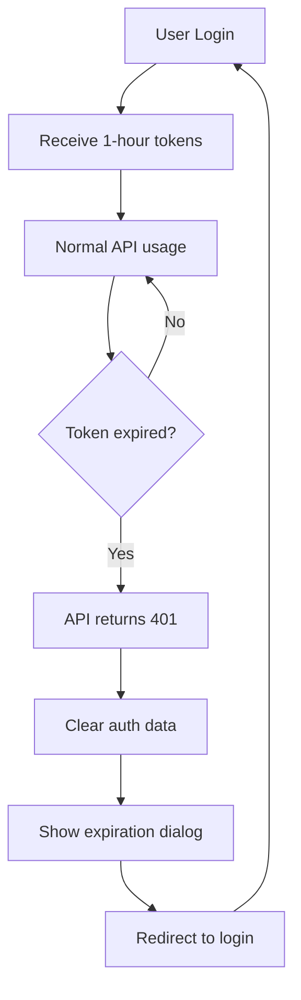

# Token Expiration and 1-Hour Re-authentication

## Overview

The CloudFront Manager implements a 1-hour token expiration policy that requires users to re-authenticate with their credentials after 1 hour of activity. This enhances security by limiting the window of exposure for compromised tokens.

## Implementation Details

### Token Validity Configuration

**CDK Stack Configuration** (`lib/cf-manager-stack.ts`):
```typescript
this.userPoolClient = new cognito.UserPoolClient(this, 'UserPoolClient', {
  userPool: this.userPool,
  authFlows: {
    userPassword: true,
    userSrp: true,
  },
  // Token validity settings for 1-hour re-authentication
  refreshTokenValidity: cdk.Duration.hours(1),    // 1 hour - Forces re-auth
  accessTokenValidity: cdk.Duration.minutes(60),  // 1 hour - API access duration
  idTokenValidity: cdk.Duration.minutes(60),      // 1 hour - User info validity
});
```

### Frontend Token Expiration Handling

**Automatic Token Validation** (`frontend-simple/js/group-utils.js`):
- **Periodic Checks**: Token validity checked every 5 minutes
- **Focus Detection**: Token checked when user returns to browser tab
- **API Call Validation**: Token checked before each API request
- **Expiration Handling**: Automatic redirect to login when token expires

**Key Features**:
```javascript
// Token expiration detection
isTokenExpired(token) {
    const payload = JSON.parse(atob(token.split('.')[1]));
    const currentTime = Math.floor(Date.now() / 1000);
    return payload.exp < currentTime;
}

// Automatic token validation
startTokenValidation() {
    // Check every 5 minutes
    setInterval(() => {
        this.checkTokenValidity();
    }, 5 * 60 * 1000);
}

// Graceful session expiration handling
handleTokenExpiration() {
    this.clearAuthData();
    if (window.confirm('Your session has expired. You will be redirected to the login page.')) {
        window.location.href = '/login.html';
    }
}
```

## User Experience

### Session Behavior

**During Active Session (< 1 hour)**:
- ✅ Normal application functionality
- ✅ All API calls work normally
- ✅ Background token validation (transparent to user)

**After 1 Hour**:
- ❌ Refresh token expires and cannot be renewed
- ❌ API calls return 401 Unauthorized
- 🔄 User automatically redirected to login page
- 🔑 Full re-authentication required (username + password)

### User Notifications

**Session Expiration Dialog**:
```
Your session has expired. You will be redirected to the login page.
[OK] [Cancel]
```

- **OK**: Immediate redirect to login
- **Cancel**: 2-second delay then automatic redirect

## Security Benefits

### Enhanced Security Features

1. **Reduced Attack Window**: 1-hour limit reduces exposure time for compromised tokens
2. **No Silent Refresh**: Tokens cannot be silently renewed - requires user interaction
3. **Audit Trail**: Clear authentication events every hour for compliance
4. **Session Hijacking Protection**: Shorter token lifetime limits hijacking impact

### Compliance Benefits

- **Regulatory Compliance**: Meets requirements for periodic re-authentication
- **Audit Logging**: Clear session boundaries for security audits
- **Access Control**: Regular validation of user access rights
- **Principle of Least Privilege**: Time-limited access reduces risk

## Technical Implementation

### Token Validation Flow



### API Error Handling

**Enhanced API Call Function** (`frontend-simple/js/main.js`):
```javascript
// Pre-flight token validation
if (window.groupManager && window.groupManager.isTokenExpired(idToken)) {
    window.groupManager.handleTokenExpiration();
    return Promise.reject({ success: false, error: 'Token expired' });
}

// Response handling for 401 errors
if (response.status === 401) {
    if (window.groupManager) {
        window.groupManager.handleTokenExpiration();
    }
    return Promise.reject({
        success: false,
        error: 'Unauthorized - Session expired',
        statusCode: 401
    });
}
```

## Configuration Options

### Alternative Token Validity Settings

**More Aggressive (30 minutes)**:
```typescript
refreshTokenValidity: cdk.Duration.minutes(30),
accessTokenValidity: cdk.Duration.minutes(30),
idTokenValidity: cdk.Duration.minutes(30),
```

**More User-Friendly (90 minutes)**:
```typescript
refreshTokenValidity: cdk.Duration.minutes(90),
accessTokenValidity: cdk.Duration.minutes(60),  // Still expire access at 1 hour
idTokenValidity: cdk.Duration.minutes(60),      // Still expire ID at 1 hour
```

### Testing Configuration

**For Testing (1 minute expiration)**:
```typescript
refreshTokenValidity: cdk.Duration.minutes(1),
accessTokenValidity: cdk.Duration.minutes(1),
idTokenValidity: cdk.Duration.minutes(1),
```

## Monitoring and Troubleshooting

### Verification Steps

1. **Login to Application**: Verify normal login works
2. **Wait for Expiration**: Wait for configured time period
3. **Test API Call**: Attempt to use application features
4. **Verify Redirect**: Confirm automatic redirect to login
5. **Re-authentication**: Verify username/password required

### Common Issues

**Issue**: Users not redirected after token expiration
**Solution**: Check browser console for JavaScript errors, verify token validation is running

**Issue**: API calls still work after token should expire
**Solution**: Verify CDK deployment completed, check Cognito User Pool Client settings

**Issue**: Immediate logout after login
**Solution**: Check for clock skew, verify token validity settings are reasonable

### Debugging Commands

```bash
# Check Cognito User Pool Client settings
aws cognito-idp describe-user-pool-client \
    --user-pool-id YOUR_USER_POOL_ID \
    --client-id YOUR_CLIENT_ID

# Verify token expiration in browser console
# Paste in browser console:
const token = localStorage.getItem('idToken');
const payload = JSON.parse(atob(token.split('.')[1]));
console.log('Token expires at:', new Date(payload.exp * 1000));
console.log('Current time:', new Date());
console.log('Expired:', payload.exp < Math.floor(Date.now() / 1000));
```

## Best Practices

### For Administrators

1. **Communicate Policy**: Inform users about 1-hour session timeout
2. **Monitor Usage**: Watch for user complaints about frequent logouts
3. **Adjust if Needed**: Consider user workflow when setting timeout duration
4. **Document Process**: Ensure users understand re-authentication requirement

### For Users

1. **Save Work Frequently**: Don't rely on long sessions for unsaved work
2. **Expect Timeouts**: Plan for periodic re-authentication
3. **Keep Credentials Ready**: Have login credentials easily accessible
4. **Report Issues**: Contact admin if experiencing unexpected logouts

## Deployment History

- **Version 2.0** (2025-07-29): Implemented 1-hour token expiration
- **CDK Stack**: Updated UserPoolClient with token validity settings
- **Frontend**: Added automatic token validation and expiration handling
- **Security**: Enhanced session management and user experience

---

**Note**: This feature significantly enhances the security posture of the CloudFront Manager application by implementing time-limited sessions with mandatory re-authentication.
